# 🎙️ TranslationAppFlutter - Nền tảng Dịch thuật đa phương tiện tích hợp học từ vựng thông minh

[](https://fastapi.tiangolo.com)
[](https://flutter.dev)
[](https://www.docker.com)
[](https://github.com/features/actions)

---

## 📝 Tóm tắt dự án (Abstract)
Trong quá trình học ngoại ngữ, tụi em nhận thấy một vấn đề rất phổ biến: khi tra từ điển hoặc dịch thuật, người học thường chỉ nhìn lướt qua rồi quên ngay sau đó vì thiếu sự liên kết với việc ôn tập. Để giải quyết bài toán này, nhóm tụi em đã phát triển **TranslationAppFlutter** – một nền tảng dịch thuật đa phương thức (dịch văn bản, dịch giọng nói STT, và trích xuất chữ từ ảnh OCR) tích hợp sổ tay học từ vựng thông minh. 

Ứng dụng di động được thiết kế theo nguyên lý ngoại tuyến trước tiên (Offline-first) với cơ sở dữ liệu Isar DB để người dùng có thể tra cứu và học từ ngay cả khi không có mạng. Khi kết nối Internet được khôi phục, hệ thống tự động đồng bộ hai chiều với máy chủ FastAPI Backend. Ngoài ra, hệ thống còn đi kèm một phân hệ Web Admin chuyên sâu giúp quản trị viên giám sát hiệu năng hệ thống thời gian thực (Real-time monitoring), quản lý ngân hàng câu hỏi trắc nghiệm (Quiz Editor) và kiểm soát lưu lượng cache của Redis.

* **Tài liệu API Swagger (Web API):** [https://refactored-space-winner-4jw4vqrppjq4f4xv-8000.app.github.dev/docs](https://refactored-space-winner-4jw4vqrppjq4f4xv-8000.app.github.dev/docs)
* **Giao diện quản trị (Web Admin):** [https://web-five-cyan-81.vercel.app/](https://web-five-cyan-81.vercel.app/)

---

## 📱 Demo giao diện thực tế (Visual Showcase)

Để mọi người có cái nhìn trực quan nhất, dưới đây là slide ảnh chụp thực tế giao diện ứng dụng di động Flutter và cổng Web Admin Portal do nhóm tụi em tự thiết kế và phát triển.

### 1. Giao diện ứng dụng di động (Flutter Client UI)

Tụi em thiết kế giao diện di động theo phong cách hiện đại, trực quan, hỗ trợ đầy đủ Dark Mode. Dưới đây là lưới các màn hình chức năng của ứng dụng:

<p align="center">
  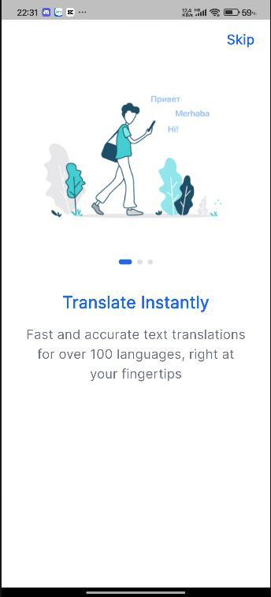
  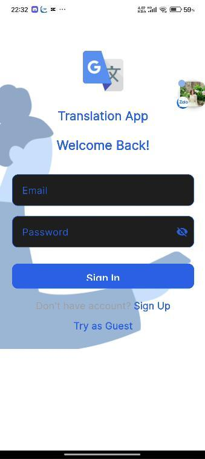
  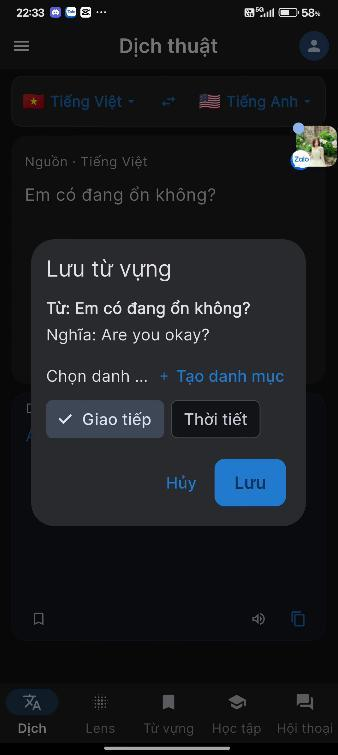
</p>

<p align="center">
  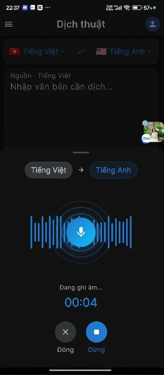
  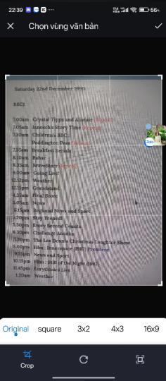
  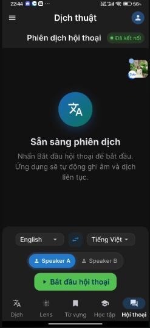
</p>

<p align="center">
  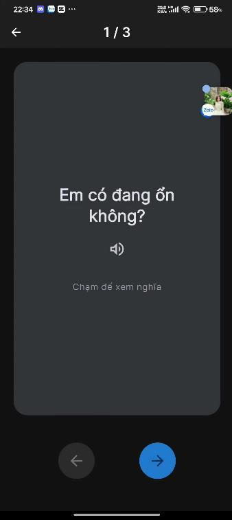
  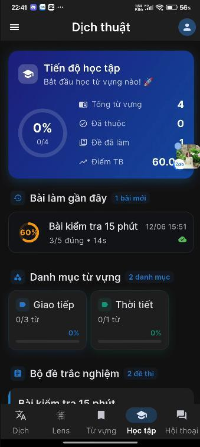
  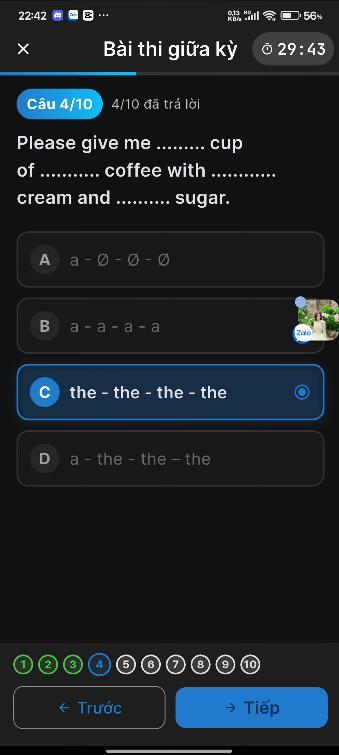
</p>

### 2. Giao diện quản trị Web (Web Admin Portal UI)

Phân hệ quản trị Web Admin được xây dựng thân thiện, trực quan với các bảng thống kê chỉ số, quản lý câu hỏi trắc nghiệm và tài liệu Swagger API:

<p align="center">
  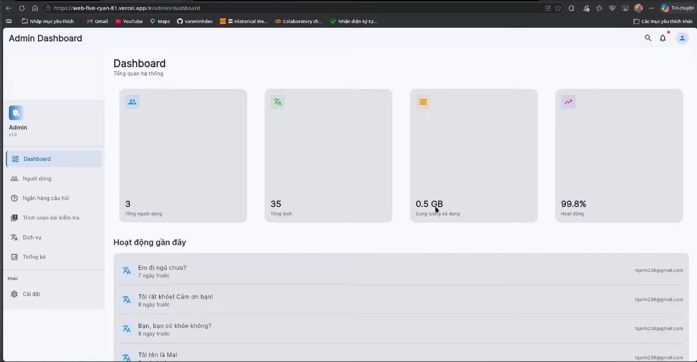
  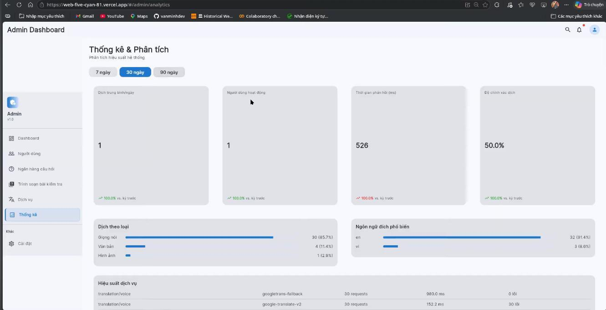
</p>

<p align="center">
  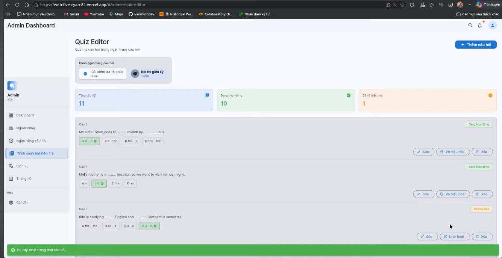
  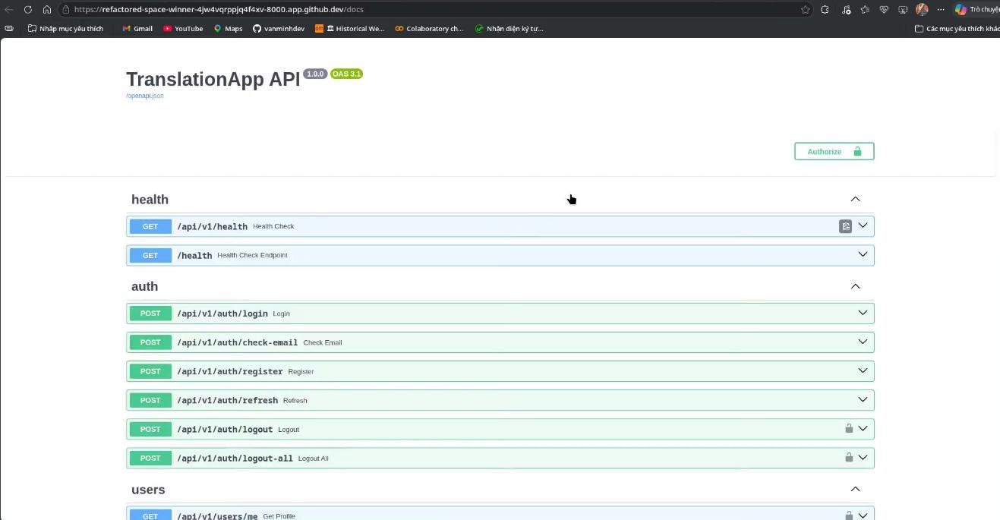
</p>

---

## 🏗️ Phương pháp & Kiến trúc hệ thống (System Design)

Hệ thống được thiết kế bài bản theo mô hình Client-Server phân tầng tách biệt, đảm bảo khả năng chịu tải, tính bảo mật cao và tối ưu trải nghiệm người dùng trên thiết bị di động.

### 1. Sơ đồ kiến trúc tổng quát (Architecture Diagram)
Luồng dữ liệu trong hệ thống tương tác qua lại giữa Flutter Client, FastAPI Server, các cơ sở dữ liệu (PostgreSQL, Redis) và các tác tử dịch thuật/AI.

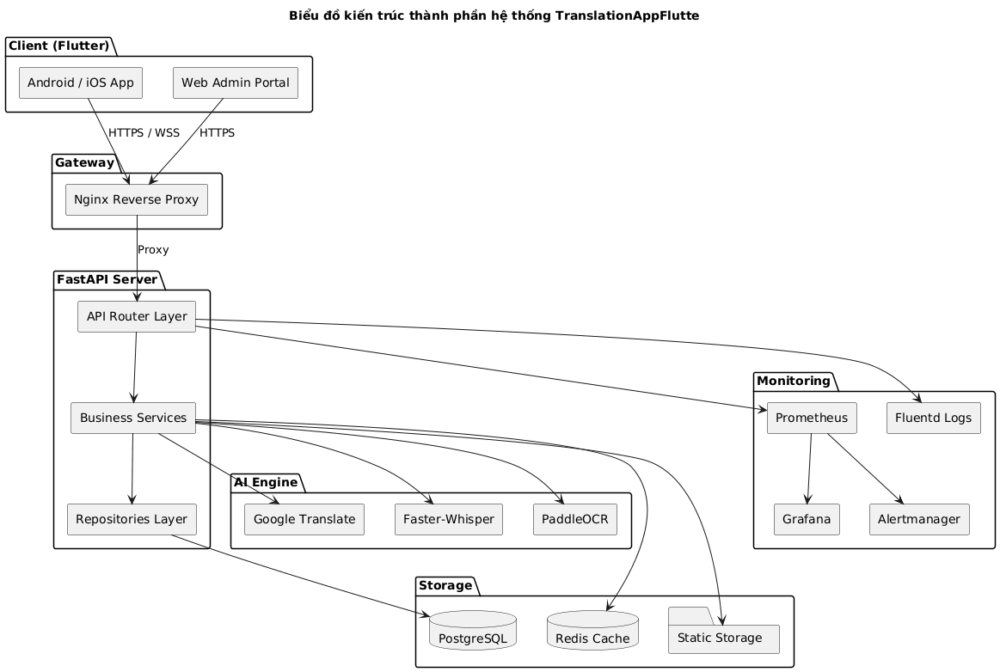

* **Sơ đồ Use Case tổng quan:** Sơ đồ chỉ ra vai trò của Khách (Guest), Thành viên (User) và Quản trị viên (Admin) tương tác với các phân hệ chức năng.
  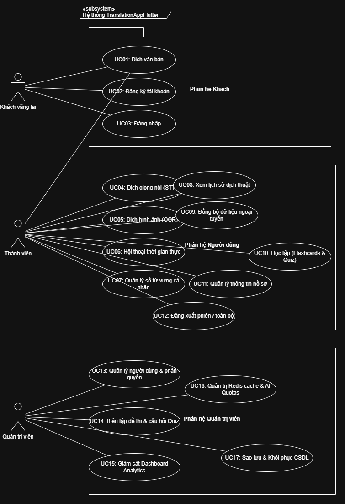

---

### 2. Thiết kế chi tiết tầng Client (Flutter Clean Architecture)
Để code không bị rối khi dự án phình to, tụi em áp dụng kiến trúc **Clean Architecture** chia làm 3 lớp độc lập: `Presentation`, `Domain`, và `Data` kết hợp quản lý trạng thái bằng **BLoC/Cubit**.

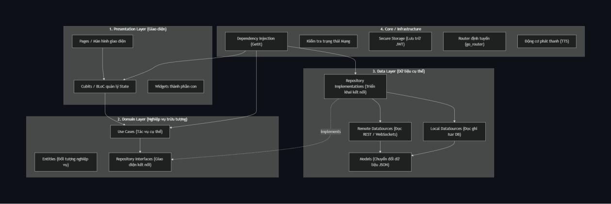

* **Presentation Layer:** Chứa UI Widgets và các Cubits điều khiển trạng thái (như `AuthCubit`, `TranslationCubit`, `VocabularyCubit`). Cubit nhận tương tác từ UI, phát ra trạng thái (`Loading`, `Loaded`, `Error`) để giao diện vẽ lại.
* **Domain Layer:** Lớp thuần Dart, không phụ thuộc vào bất kỳ thư viện ngoài nào. Nó định nghĩa các thực thể (`Entities`), các hợp đồng repository (`Repository Interfaces`) và các nghiệp vụ đơn lẻ (`UseCases` như `LoginUseCase`, `TranslateTextUseCase`). Luồng xử lý trả về kiểu `Either<Failure, T>` của thư viện `dartz` để quản lý lỗi chặt chẽ.
* **Data Layer:** Hiện thực hóa các repository từ tầng Domain. Nó chứa các nguồn dữ liệu (`Datasources` gồm `RemoteDatasource` giao tiếp API và `LocalDatasource` tương tác với Isar DB để lưu trữ offline) và các `Models` hỗ trợ tuần tự hóa JSON.

---

### 3. Thiết kế chi tiết tầng Server (FastAPI Layered Stateless Architecture)
FastAPI Backend được thiết kế theo hướng Stateless phân lớp, tận dụng tối đa cơ chế bất đồng bộ (`async/await`) kết hợp driver `asyncpg` để truy xuất PostgreSQL tốc độ cao.

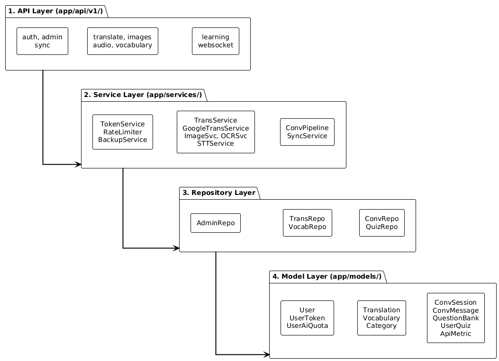

* **API Layer (Endpoints):** Định nghĩa các RESTful API routes (`/auth`, `/translate`, `/audio`, `/sync`, `/websocket`) sử dụng Pydantic Schemas để kiểm chuẩn dữ liệu đầu vào.
* **Service Layer:** Nơi xử lý toàn bộ logic nghiệp vụ cốt lõi (như điều phối dịch thuật, tiền xử lý âm thanh, bóc tách chữ ảnh OCR, đồng bộ dữ liệu).
* **Repository Layer:** Sử dụng SQLAlchemy ORM để truy xuất dữ liệu từ Postgres Database một cách an toàn thông qua Repository Pattern, giúp dễ dàng viết Unit Tests độc lập.

---

### 4. Thiết kế cơ sở dữ liệu (Database Schema)
Cơ sở dữ liệu PostgreSQL được chuẩn hóa để lưu trữ thông tin người dùng, lịch sử dịch thuật, sổ tay từ vựng, các phiên hội thoại và ngân hàng đề thi trắc nghiệm.

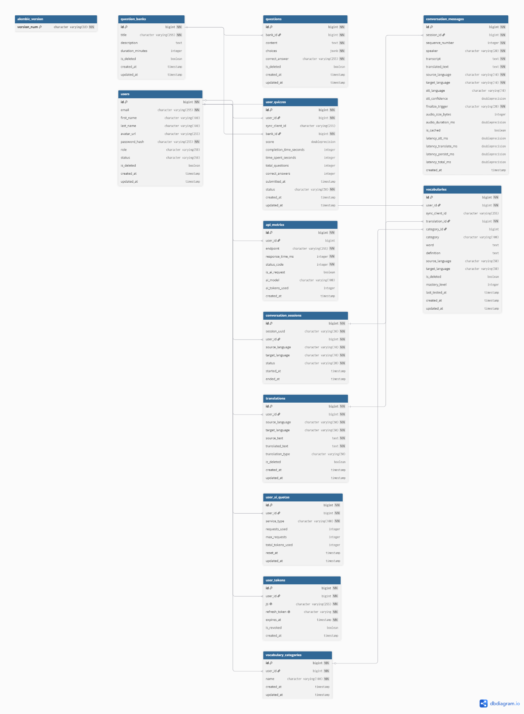

Tụi em thiết kế các bảng quan trọng bao gồm:
* `users` & `user_tokens`: Lưu trữ thông tin tài khoản và định danh JTI token phục vụ cơ chế bảo mật.
* `vocabularies` & `vocabulary_categories`: Quản lý sổ tay từ vựng của người dùng, hỗ trợ cờ trạng thái đồng bộ (`is_synced`, `is_deleted`) phục vụ giải thuật Offline-first.
* `translations`: Lưu trữ lịch sử dịch thuật văn bản của hệ thống.
* `conversations` & `realtime_sessions`: Lưu trữ các phiên và lịch sử hội thoại dịch thuật thời gian thực.
* `question_banks` & `questions` & `quiz_submissions`: Quản lý ngân hàng đề thi và kết quả làm bài trắc nghiệm của học viên.

---

### 5. Các mô hình & Giải thuật cốt lõi (Core Technologies)

* **Giải pháp tiền xử lý và dịch giọng nói (Speech-to-Text):**
  Để nhận diện giọng nói chính xác từ nhiều định dạng âm thanh đầu vào (MP3, M4A, AAC, WAV, FLAC, OGG) từ điện thoại, server chạy một pipeline xử lý âm thanh tự động qua `librosa` và `pydub`: tự động đổi kênh âm thanh (Stereo sang Mono), resample tần số lấy mẫu về chuẩn 16kHz, chuẩn hóa biên độ âm thanh về [-1, 1], mã hóa thành định dạng WAV PCM 16-bit. Sau đó tệp WAV này được chuyển qua engine AI `faster-whisper` chạy cục bộ để trích xuất text trước khi gửi qua API dịch thuật.
* **Giải pháp nhận diện chữ từ ảnh (OpenCV + OCR):**
  Khi chụp ảnh từ camera di động, chất lượng ảnh thường bị mờ hoặc lệch góc. Tụi em viết một module tiền xử lý ảnh trên backend bằng `OpenCV` để chuyển đổi ảnh xám (Grayscale), lọc nhiễu Gaussian, áp dụng ngưỡng thích ứng (Adaptive Thresholding) để tăng độ tương phản của chữ viết. Sau đó đưa ảnh qua `PaddleOCR` (hoặc fallback sang `Tesseract`) để trích xuất chữ viết có độ chính xác cao.
* **Dịch thuật song ngữ thời gian thực (WebSocket Duplex Connection):**
  Với tính năng dịch hội thoại trực tiếp, tụi em sử dụng kết nối song công `WebSocket`. Client chia luồng âm thanh thu từ mic thành các chunk nhỏ (PCM format), truyền liên tục lên server. Server sử dụng cơ chế phát hiện giọng nói (VAD - Voice Activity Detection) thông qua năng lượng âm thanh (RMS threshold). Khi người nói dừng khoảng 1.5 giây, server sẽ gom cụm chunk âm thanh lại, dịch nhanh bằng cache Redis (hoặc API ngoài) rồi đẩy kết quả dịch song ngữ về cho cả hai client hiển thị tức thời dạng bong bóng chat.
* **Đồng bộ hóa dữ liệu ngoại tuyến (Offline-First Sync Engine):**
  Khi người dùng lưu từ vựng hoặc làm bài Quiz lúc mất mạng, dữ liệu sẽ được lưu vào cơ sở dữ liệu cục bộ **Isar DB** kèm trạng thái `is_synced = false`. Khi thiết bị kết nối mạng trở lại, một Background Worker sẽ kích hoạt giải thuật đồng bộ hai chiều:
  1. **Push:** Đẩy toàn bộ dữ liệu có `is_synced = false` hoặc `is_deleted = true` lên server. Server xử lý ghi đè theo giải thuật Last-Write-Wins (dựa trên timestamp cập nhật) để giải quyết xung đột dữ liệu.
  2. **Pull:** Tải dữ liệu mới nhất từ server về ghi đè vào DB cục bộ, sau đó cập nhật cờ `is_synced = true` cho các bản ghi cục bộ.
* **Cơ chế Caching & Bảo mật JTI Blacklist:**
  Tụi em tích hợp **Redis Cache** làm bộ nhớ đệm cho các bản dịch tĩnh, giúp giảm thời gian phản hồi cho các từ/câu đã dịch trước đó xuống mức cực thấp (< 50ms cho cache hit), đồng thời giảm chi phí gọi API Google Cloud. 
  Về bảo mật, hệ thống sử dụng cơ chế Single-use Refresh Token. Mỗi khi client gửi Refresh Token để lấy Access Token mới, Refresh Token cũ sẽ bị hủy bỏ (Single-use). Hệ thống sử dụng cơ chế lưu trữ JTI (JSON Web Token ID) kết hợp giữa Redis (truy xuất nhanh O(1) để kiểm tra token đã đăng xuất / blacklist) và PostgreSQL (lưu vết bền vững đề phòng Redis bị restart).

---

## 📊 Kết quả thực nghiệm & Kiểm thử (Quantitative Results)

Tụi em rất coi trọng chất lượng phần mềm nên đã xây dựng một bộ kiểm thử tự động toàn diện từ Unit Test, Integration Test đến End-to-End (E2E) Flow Test. Trên cả môi trường máy cá nhân và CI (GitHub Actions), hệ thống đều đạt độ ổn định tuyệt đối:

| Phân hệ hệ thống | Phân loại kiểm thử | Số kịch bản (Test Cases) | Tỷ lệ vượt qua (Pass Rate) | Độ phủ mã nguồn (Coverage) | Ghi chú |
| :--- | :--- | :---: | :---: | :---: | :--- |
| **Backend API** | Unit & Integration Tests | 229 | 100% | 85.2% | Pytest kiểm tra chức năng OCR, âm thanh Whisper, Cache và Database |
| **Backend API** | End-to-End API Tests | 13 | 100% | 80.1% | Pytest xác thực luồng đăng nhập, phân quyền Admin và Token Blacklist |
| **Flutter Client** | Unit & Widget Tests | 11 | 100% | 76.5% | Xác thực hiển thị Widget và trạng thái nghiệp vụ Cubit |
| **Flutter Client** | User E2E Tests | 10 | 100% | - | Mô phỏng trọn vẹn quy trình dịch hội thoại qua WebSocket giả lập |
| **Flutter Client** | Admin E2E Tests | 17 | 100% | - | Mô phỏng toàn bộ thao tác quản lý User, soạn thảo đề thi Quiz của Admin |
| **Flutter Client** | Integration E2E Tests | 12 | 100% | - | Xác thực tích hợp toàn trình, kiểm tra tính đúng đắn dữ liệu mẫu |

### Thành tích đạt được:
Đề tài đồ án môn học Phát triển ứng dụng đa nền tảng nâng cao này của nhóm đã được đánh giá rất cao, đạt điểm số xuất sắc nhờ quy trình DevOps chuẩn chỉ, độ phủ test lớn và thiết kế kiến trúc Clean Architecture chỉn chu trên thiết bị di động.

---

## ⚙️ Hướng dẫn cài đặt & Triển khai (DevOps & Reproducibility)

Hệ thống hỗ trợ chạy trực tiếp trên máy local (cho mục đích phát triển) hoặc đóng gói container hóa hoàn toàn qua Docker.

### 1. Cấu hình biến môi trường
Trước khi chạy, bạn cần copy tệp mẫu cấu hình sang tệp chính thức tại thư mục `backend/`:
```bash
cd backend
cp .env.example .env
```
Mở tệp `.env` vừa tạo và cấu hình các thông số phù hợp (DATABASE_URL kết nối PostgreSQL, REDIS_URL kết nối Redis, SECRET_KEY bảo mật, và khóa Google Cloud Translation API nếu có).

---

### 2. Triển khai nhanh với Docker Compose (All-in-Docker)
Cách nhanh nhất để dựng toàn bộ hệ thống gồm Database, Redis cache, Fluentd log aggregator, Nginx web server và FastAPI Backend:
```bash
# 1. Khởi động toàn bộ container ở chế độ chạy ngầm
docker-compose up -d

# 2. Chạy database migration để tạo các bảng trong PostgreSQL
docker-compose exec backend alembic upgrade head

# 3. Nạp dữ liệu mẫu cho tính năng học tập/thi trắc nghiệm
docker-compose exec backend python app/scripts/seed_learning_data.py
```
Sau khi chạy xong:
* API Backend chạy tại: `http://localhost:8000`
* Tài liệu Swagger API tại: `http://localhost:8000/docs`
* Giao diện quản trị Web Admin chạy tại: `http://localhost:8080/admin` (được Nginx cấu hình trỏ vào bản build tĩnh của Flutter Web).

---

### 3. Triển khai thủ công cho lập trình viên (Hybrid Mode)
Nếu bạn muốn chạy Backend trực tiếp trên máy chủ local để dễ dàng debug và hot-reload:

**Bước 1: Khởi động cơ sở dữ liệu và cache bằng Docker**
```bash
docker-compose up -d db redis
```

**Bước 2: Thiết lập và chạy FastAPI Backend**
```bash
cd backend
python -m venv venv
# Trên Windows:
.\venv\Scripts\activate
# Trên macOS/Linux:
source venv/bin/activate

# Cài đặt thư viện
pip install -r requirements.txt

# Tạo bảng và khởi chạy server
alembic upgrade head
uvicorn app.main:app --reload
```

**Bước 3: Khởi chạy Flutter Client (Mobile)**
```bash
cd frontend
flutter pub get
flutter run
```
*(Nếu muốn biên dịch phiên bản chạy trên web cho Admin Portal: `flutter build web`)*

---

### 4. Hệ thống Giám sát Hiệu năng (Monitoring Stack)
Để đảm bảo hệ thống vận hành trơn tru ở môi trường Production, tụi em đã thiết lập một hệ thống giám sát hiệu năng hoàn chỉnh sử dụng file cấu hình `docker-compose.monitoring.yml`:
* **Fluentd:** Thu thập log tập trung từ Nginx và FastAPI Backend, lưu trữ và xoay vòng log định kỳ.
* **Prometheus:** Định kỳ quét các metrics hiệu năng (RAM, CPU, số lượng request/giây, thời gian phản hồi API) của server FastAPI.
* **Grafana:** Trực quan hóa các metrics thu thập từ Prometheus lên các bảng Dashboard sinh động. Bạn có thể import tệp cấu hình dashboard có sẵn tại [grafana/dashboards/translation_app.json](file:///c:/Users/minhk/Downloads/TranslationAppFlutter/grafana/dashboards/translation_app.json) để theo dõi hệ thống thời gian thực.

---

## 📁 Cấu trúc thư mục dự án (Directory Structure)

Dưới đây là sơ đồ tổ chức mã nguồn của toàn bộ dự án, được phân hoạch rõ ràng giữa Client (Flutter) và Server (FastAPI).

```
TranslationAppFlutter/
├── backend/                                 # --- MÃ NGUỒN BACKEND (FastAPI) ---
│   ├── alembic/                             # Database migrations lịch sử tạo bảng
│   ├── app/                                 # Thư mục ứng dụng chính
│   │   ├── api/v1/endpoints/                # Các route API Restful & Websocket
│   │   ├── core/                            # Cấu hình hệ thống, bảo mật, kết nối DB/Redis
│   │   ├── models/                          # Các thực thể dữ liệu SQLAlchemy
│   │   ├── repositories/                    # Lớp truy xuất DB (Repository Pattern)
│   │   ├── schemas/                         # Pydantic schemas kiểm chuẩn dữ liệu
│   │   ├── services/                        # Logic nghiệp vụ (STT, OCR, Sync, Token)
│   │   └── main.py                          # Điểm chạy đầu vào của Backend Server
│   ├── tests/                               # Bộ unit tests & integration tests của server
│   ├── Dockerfile                           # Hướng dẫn đóng gói container backend
│   └── requirements.txt                     # Các thư viện Python cần thiết
│
├── frontend/                                # --- MÃ NGUỒN CLIENT (Flutter) ---
│   ├── assets/                              # Tài nguyên hình ảnh, fonts, branding
│   ├── lib/                                 # Thư mục mã nguồn Dart chính
│   │   ├── core/                            # Tiện ích dùng chung, theme, router, secure storage
│   │   ├── features/                        # Các chức năng của app theo Clean Architecture
│   │   │   ├── auth/                        # Quản lý đăng ký, đăng nhập thành viên
│   │   │   ├── translation/                 # Dịch văn bản, tích hợp phát âm TTS
│   │   │   ├── speech/                      # Thu âm giọng nói, dịch nói song ngữ
│   │   │   ├── ocr/                         # Chụp ảnh tài liệu, nhận diện ký tự
│   │   │   ├── conversation/                # Phiên dịch hội thoại qua WebSocket
│   │   │   ├── vocabulary/                  # Quản lý sổ tay từ vựng ngoại tuyến (Isar DB)
│   │   │   ├── learning/                    # Ôn tập Flashcard, làm Quiz trắc nghiệm
│   │   │   └── sync/                        # Đồng bộ hóa ngoại tuyến Offline-first
│   │   └── main.dart                        # Điểm chạy đầu vào của Flutter Client
│   ├── test/                                # Bộ unit, widget & E2E tests client
│   └── pubspec.yaml                         # Cấu hình dependencies của Flutter
│
├── grafana/                                 # File cấu hình bảng Dashboard giám sát của Grafana
├── nginx.conf                               # Cấu hình reverse proxy trỏ API và web tĩnh Admin
├── prometheus.yml                           # File cấu hình quét metrics của Prometheus
├── docker-compose.yml                       # File docker compose phát triển chính
└── docker-compose.monitoring.yml            # File docker compose chạy stack giám sát
```

---

## 🛠️ Công nghệ sử dụng (Tech Stack)

### Client (Frontend):
* **Ngôn ngữ:** Dart (Flutter SDK)
* **Quản lý trạng thái:** BLoC / Cubit Pattern
* **Cơ sở dữ liệu cục bộ:** Isar Database (NoSQL cục bộ hiệu năng cao)
* **Bảo mật cục bộ:** Flutter Secure Storage (lưu trữ khóa JWT mã hóa)
* **Routing:** GoRouter (Khai báo route dạng cây điều hướng linh hoạt)
* **Kiểm thử:** flutter_test, mocktail (mock data/repository)

### Server (Backend):
* **Ngôn ngữ:** Python (FastAPI framework asynchronous)
* **Cơ sở dữ liệu:** PostgreSQL 15 (lưu trữ bền vững)
* **Bộ nhớ đệm & Blacklist:** Redis 7 (chọn giải thuật thu hồi bộ nhớ LRU cho cache hit)
* **ORM:** SQLAlchemy 2.0 + Alembic (quản lý migration dữ liệu)
* **Log Aggregator:** Fluentd
* **AI Engines:** faster-whisper (STT), PaddleOCR / Tesseract (OCR)
* **Thư viện phụ trợ:** OpenCV (tiền xử lý ảnh), librosa & pydub (tiền xử lý âm thanh), pytest (kiểm thử backend)

### DevOps & Infrastructure:
* **Containerization:** Docker & Docker Compose
* **Web Server & Proxy:** Nginx Alpine
* **Monitoring Stack:** Prometheus & Grafana
* **CI/CD:** GitHub Actions (tự động chạy linting Ruff/Black và chạy bộ test suite)

---

## 💖 Lời cảm ơn & Tài liệu tham khảo (Acknowledgments)

### Giảng viên hướng dẫn:
Tập thể nhóm 7 tụi em xin bày tỏ lòng biết ơn chân thành và sâu sắc nhất đến **ThS. Lê Văn Minh**. Trong suốt quá trình thực hiện đồ án môn học Phát triển ứng dụng đa nền tảng nâng cao, thầy đã luôn tận tâm dìu dắt, định hướng kiến trúc hệ thống và chia sẻ cho tụi em những kinh nghiệm thực tiễn vô cùng quý báu trong ngành phần mềm. Những lời khuyên của thầy chính là bệ phóng giúp tụi em tự tin hoàn thành sản phẩm này.

### Sinh viên thực hiện (Nhóm 7 - Lớp học phần 67CS):
1. **Lã Minh Khánh** – MSV: 4004267
2. **Trịnh Quỳnh Anh** – MSV: 0279367
3. **Nguyễn Hải Cường** – MSV: 0174067
4. **Hoàng Quốc Vinh** – MSV: 0312867
5. **Phạm Hồng Thái** – MSV: 0127067

### Tài liệu tham khảo chính:
* Tài liệu lập trình Flutter: [https://flutter.dev/docs](https://flutter.dev/docs)
* Tài liệu hướng dẫn FastAPI: [https://fastapi.tiangolo.com](https://fastapi.tiangolo.com)
* Mã nguồn nhận dạng ký tự PaddleOCR: [https://github.com/PaddlePaddle/PaddleOCR](https://github.com/PaddlePaddle/PaddleOCR)
* Mã nguồn nhận diện giọng nói faster-whisper: [https://github.com/SYSTRAN/faster-whisper](https://github.com/SYSTRAN/faster-whisper)
* Cơ sở dữ liệu ngoại tuyến Isar DB: [https://isar.dev](https://isar.dev)
* Hướng dẫn thiết lập hệ thống Docker Compose: [https://docs.docker.com/compose](https://docs.docker.com/compose)
