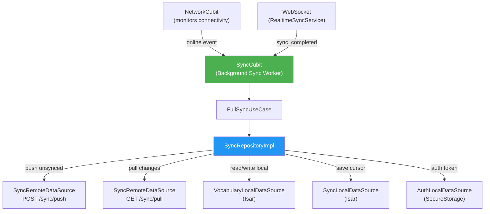

# Background Sync Worker v1 — Xây dựng cơ chế đồng bộ dữ liệu nền

## Bối cảnh

Hiện tại, ứng dụng đã có một `SyncCubit` cơ bản chỉ đồng bộ **vocabulary** qua endpoint legacy `POST /api/v1/sync/vocabulary`. Backend đã có sẵn hệ thống sync hiện đại hơn với:

- **Push endpoint**: `POST /api/v1/sync/push` — đẩy nhiều loại resource (flashcard, quiz_attempt)
- **Pull endpoint**: `GET /api/v1/sync/pull` — kéo delta changes với cursor-based pagination

Tuy nhiên, Flutter client chưa sử dụng các endpoint push/pull mới này. Task này sẽ nâng cấp sync feature để sử dụng hệ thống sync mới, đồng thời xây dựng Background Sync Worker đầy đủ.

---

## User Review Required

> [!IMPORTANT]
> **Sync scope**: Plan này tập trung vào đồng bộ **vocabulary (flashcard)** và **history (translation history)**. Quiz results cũng được hỗ trợ qua push endpoint nhưng pull sẽ chỉ xử lý flashcard trước. Nếu bạn muốn thêm quiz_attempt sync đầy đủ trong bản v1 này, hãy cho tôi biết.

> [!WARNING]
> **Migration**: Khi chuyển từ legacy `/sync/vocabulary` sang `/sync/push` + `/sync/pull`, cần đảm bảo backward compatibility. Plan này giữ lại logic legacy sync nhưng thêm mới push/pull flow.

---

## Open Questions

> [!IMPORTANT]
> 1. **Sync cursor persistence**: Plan lưu sync cursor (next_cursor từ pull response) vào Isar. Bạn có muốn lưu vào `flutter_secure_storage` hay Isar là phù hợp?
> 2. **History sync**: Backend hiện chưa có push endpoint riêng cho history records. Bạn muốn tôi chỉ pull history từ server (one-way sync) hay cần tạo thêm backend endpoint cho history push?
> 3. **Auto-sync interval**: Ngoài việc sync khi network chuyển từ offline→online, bạn có muốn thêm periodic sync (ví dụ mỗi 5 phút) hay chỉ event-driven?

---

## Proposed Changes

### Component 1: Sync Domain Layer — Mở rộng entities & repository interface

Mở rộng domain layer để hỗ trợ multi-resource push/pull sync.

#### [NEW] [sync_push_entity.dart](file:///c:/Users/minhk/Downloads/TranslationAppFlutter/frontend/lib/features/sync/domain/entities/sync_push_entity.dart)
- Entity cho push request item: `SyncPushItemEntity` (resource, clientId, serverId, updatedAt, payload)
- Entity cho push response: `SyncPushResponseEntity` (succeededCount, failedCount, results)
- Entity cho push result item: `SyncPushResultItemEntity`

#### [NEW] [sync_pull_entity.dart](file:///c:/Users/minhk/Downloads/TranslationAppFlutter/frontend/lib/features/sync/domain/entities/sync_pull_entity.dart)
- Entity cho pull response item: `SyncPullItemEntity` (resource, serverId, updatedAt, payload)
- Entity cho pull response: `SyncPullResponseEntity` (items, nextCursor, hasMore)

#### [MODIFY] [sync_repository.dart](file:///c:/Users/minhk/Downloads/TranslationAppFlutter/frontend/lib/features/sync/domain/repositories/sync_repository.dart)
- Thêm method `pushChanges()` — push all pending local changes
- Thêm method `pullChanges({String? cursor})` — pull server changes with cursor
- Thêm method `fullSync()` — orchestrate push → pull → update local
- Giữ nguyên `syncVocabulary()` cho backward compatibility

---

### Component 2: Sync Data Layer — Models & DataSources

#### [NEW] [sync_push_model.dart](file:///c:/Users/minhk/Downloads/TranslationAppFlutter/frontend/lib/features/sync/data/models/sync_push_model.dart)
- `SyncPushItemModel` — DTO cho push request, maps from VocabularyModel/HistoryModel
- `SyncPushRequestModel` — batch request wrapper
- `SyncPushResultItemModel` — DTO cho push response item
- `SyncPushResponseModel` — DTO cho full push response

#### [NEW] [sync_pull_model.dart](file:///c:/Users/minhk/Downloads/TranslationAppFlutter/frontend/lib/features/sync/data/models/sync_pull_model.dart)
- `SyncPullItemModel` — DTO cho pull response item
- `SyncPullResponseModel` — DTO cho full pull response

#### [NEW] [sync_cursor_model.dart](file:///c:/Users/minhk/Downloads/TranslationAppFlutter/frontend/lib/features/sync/data/models/sync_cursor_model.dart)
- Isar `@collection` class để persist sync cursor
- Fields: `id`, `cursorValue`, `lastSyncAt`

#### [NEW] [sync_local_datasource.dart](file:///c:/Users/minhk/Downloads/TranslationAppFlutter/frontend/lib/features/sync/data/datasources/sync_local_datasource.dart)
- Abstract interface + implementation
- `getSyncCursor()` → String?
- `saveSyncCursor(String cursor)` → void
- `clearSyncCursor()` → void
- `getLastSyncTimestamp()` → DateTime?

#### [MODIFY] [sync_remote_datasource.dart](file:///c:/Users/minhk/Downloads/TranslationAppFlutter/frontend/lib/features/sync/data/datasources/sync_remote_datasource.dart)
- Thêm method `pushChanges()` — gọi `POST /api/v1/sync/push`
- Thêm method `pullChanges()` — gọi `GET /api/v1/sync/pull`
- Giữ nguyên `syncVocabulary()` cho legacy

---

### Component 3: Sync Repository Implementation — Core Sync Logic

#### [MODIFY] [sync_repository_impl.dart](file:///c:/Users/minhk/Downloads/TranslationAppFlutter/frontend/lib/features/sync/data/repositories/sync_repository_impl.dart)

Thêm `fullSync()` method thực hiện toàn bộ sync flow:

```
fullSync() flow:
1. Gather unsynced vocabulary records from Isar (isSynced = false)
2. Build SyncPushItems cho từng record
3. POST /api/v1/sync/push
4. Process push results:
   - Mark synced items as isSynced = true
   - Update backendId cho newly created items
5. GET /api/v1/sync/pull?cursor={savedCursor}
6. Loop until hasMore = false:
   - Upsert pulled flashcard items into Isar vocabulary
   - Save next_cursor to Isar
7. Return overall sync result
```

**Retry logic** (§5.3):
- Exponential backoff: 5s → 10s → 30s
- On 401 (AuthException): stop sync, user must re-login
- On ServerException: retry with backoff

---

### Component 4: New UseCases

#### [NEW] [full_sync_usecase.dart](file:///c:/Users/minhk/Downloads/TranslationAppFlutter/frontend/lib/features/sync/domain/usecases/full_sync_usecase.dart)
- `FullSyncUseCase extends UseCase<SyncPushResponseEntity, NoParams>`
- Gọi `repository.fullSync()`
- Sử dụng bởi SyncCubit

---

### Component 5: SyncCubit Enhancement

#### [MODIFY] [sync_state.dart](file:///c:/Users/minhk/Downloads/TranslationAppFlutter/frontend/lib/features/sync/presentation/bloc/sync_state.dart)
- Thêm `SyncProgress` state với chi tiết push/pull progress
- Thêm `lastSyncAt` field vào `SyncSuccess`

#### [MODIFY] [sync_cubit.dart](file:///c:/Users/minhk/Downloads/TranslationAppFlutter/frontend/lib/features/sync/presentation/bloc/sync_cubit.dart)
- Chuyển `_triggerSync()` sang gọi `FullSyncUseCase` thay vì `SyncDataUseCase`
- Giữ nguyên network monitoring logic
- Giữ nguyên WebSocket realtime sync
- Thêm `requestManualSync()` cho user-triggered sync
- Thêm guard chống duplicate sync (đã có `_isSyncing`)

---

### Component 6: Dependency Injection

#### [MODIFY] [injection_container.dart](file:///c:/Users/minhk/Downloads/TranslationAppFlutter/frontend/lib/injection_container.dart)
- Register `SyncLocalDataSource` và implementation
- Register `FullSyncUseCase`
- Update `SyncRepositoryImpl` constructor với `SyncLocalDataSource`
- **Cần generate Isar schema cho SyncCursorModel** → chạy `build_runner`

---

### Component 7: Isar Schema Update

#### Cần chạy `build_runner` sau khi thêm `SyncCursorModel`

```shell
cd frontend && dart run build_runner build --delete-conflicting-outputs
```

#### [MODIFY] [isar_database.dart](file:///c:/Users/minhk/Downloads/TranslationAppFlutter/frontend/lib/core/database/isar_database.dart)
- Thêm `SyncCursorModel` vào danh sách schemas khi init Isar

---

## Tổng quan kiến trúc



## Files tạo mới / sửa đổi

| Action | File | Layer |
|--------|------|-------|
| NEW | `sync_push_entity.dart` | Domain |
| NEW | `sync_pull_entity.dart` | Domain |
| MODIFY | `sync_repository.dart` | Domain |
| NEW | `full_sync_usecase.dart` | Domain |
| NEW | `sync_push_model.dart` | Data |
| NEW | `sync_pull_model.dart` | Data |
| NEW | `sync_cursor_model.dart` | Data |
| NEW | `sync_local_datasource.dart` | Data |
| MODIFY | `sync_remote_datasource.dart` | Data |
| MODIFY | `sync_repository_impl.dart` | Data |
| MODIFY | `sync_state.dart` | Presentation |
| MODIFY | `sync_cubit.dart` | Presentation |
| MODIFY | `injection_container.dart` | Core |
| MODIFY | `isar_database.dart` | Core |

---

## Verification Plan

### Automated Tests
- Chạy `flutter analyze` để check static analysis
- Build app thành công: `flutter build apk --debug`

### Manual Verification
1. Khởi động backend server
2. Đăng nhập trên app
3. Tạo vocabulary mới khi offline → kiểm tra `isSynced = false` trong Isar
4. Bật mạng → kiểm tra SyncCubit trigger push/pull tự động
5. Kiểm tra log output cho sync flow: push items → pull changes → update cursor
6. Tắt mạng → tạo thêm vocabulary → bật mạng → kiểm tra sync lại
7. Kiểm tra retry khi server trả 500 (exponential backoff: 5s → 10s → 30s)
