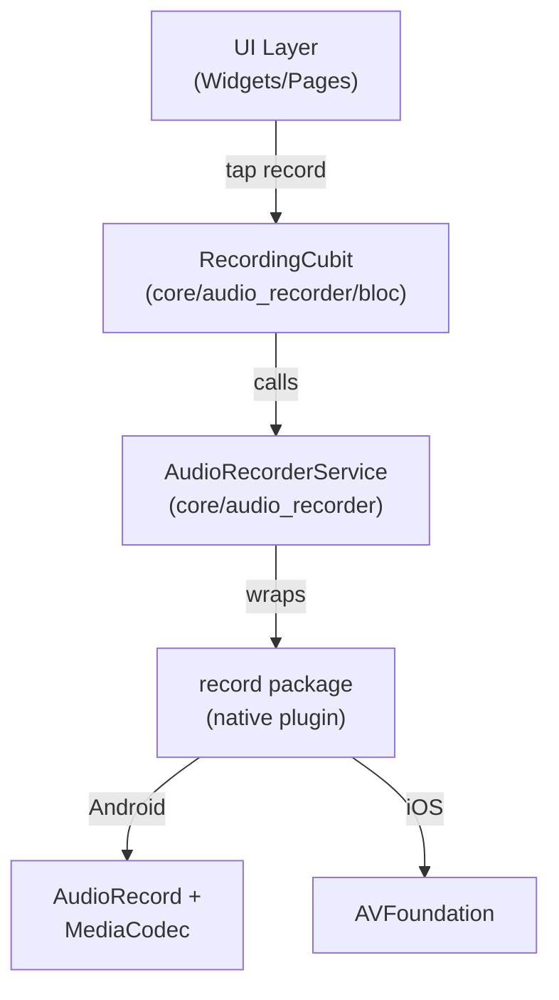

# 🎙️ Audio Recording Implementation Summary

## Tổng quan

Triển khai đầy đủ luồng ghi âm (Audio Recording) cho ứng dụng dịch thuật, phục vụ UC05 (Dịch qua giọng nói). Tuân thủ Clean Architecture và các quy tắc dự án.

---

## Kiến trúc đã triển khai



---

## Files Created/Modified

### ✅ New Files

| File | Purpose |
|---|---|
| [audio_recorder_service.dart](file:///c:/Users/minhk/Downloads/TranslationAppFlutter/frontend/lib/core/audio_recorder/audio_recorder_service.dart) | Abstract interface + implementation wrapping `record` plugin |
| [recording_state.dart](file:///c:/Users/minhk/Downloads/TranslationAppFlutter/frontend/lib/core/audio_recorder/bloc/recording_state.dart) | Sealed state classes (Idle, PermissionDenied, InProgress, Paused, Success, Failure) |
| [recording_cubit.dart](file:///c:/Users/minhk/Downloads/TranslationAppFlutter/frontend/lib/core/audio_recorder/bloc/recording_cubit.dart) | Cubit managing recording lifecycle + elapsed timer |

### ✏️ Modified Files

| File | Change |
|---|---|
| [pubspec.yaml](file:///c:/Users/minhk/Downloads/TranslationAppFlutter/frontend/pubspec.yaml) | Added `record: ^5.2.0` dependency |
| [AndroidManifest.xml](file:///c:/Users/minhk/Downloads/TranslationAppFlutter/frontend/android/app/src/main/AndroidManifest.xml) | Added `RECORD_AUDIO` permission |
| [exceptions.dart](file:///c:/Users/minhk/Downloads/TranslationAppFlutter/frontend/lib/core/error/exceptions.dart) | Added `RecordingException`, `PermissionDeniedException` |
| [failures.dart](file:///c:/Users/minhk/Downloads/TranslationAppFlutter/frontend/lib/core/error/failures.dart) | Added `RecordingFailure`, `PermissionFailure` |
| [injection_container.dart](file:///c:/Users/minhk/Downloads/TranslationAppFlutter/frontend/lib/injection_container.dart) | Registered `AudioRecorderService` (LazySingleton) + `RecordingCubit` (Factory) |

---

## Cấu trúc thư mục

```
lib/core/audio_recorder/
├── audio_recorder_service.dart    # Interface + Impl
└── bloc/
    ├── recording_cubit.dart       # State management
    └── recording_state.dart       # Sealed state classes
```

---

## Cách sử dụng từ UI

```dart
// 1. Provide cubit trong widget tree
BlocProvider(
  create: (_) => sl<RecordingCubit>(),
  child: const SpeechPage(),
),

// 2. Start recording
context.read<RecordingCubit>().startRecording();

// 3. Stop recording — nhận file path
context.read<RecordingCubit>().stopRecording();

// 4. Cancel recording — xóa file tạm
context.read<RecordingCubit>().cancelRecording();

// 5. Pause / Resume
context.read<RecordingCubit>().pauseRecording();
context.read<RecordingCubit>().resumeRecording();

// 6. Listen to states
BlocBuilder<RecordingCubit, RecordingState>(
  builder: (context, state) {
    return switch (state) {
      RecordingIdle() => const RecordButton(),
      RecordingPermissionDenied() => const PermissionPrompt(),
      RecordingInProgress(:final elapsed) => Timer(elapsed),
      RecordingPaused(:final elapsed) => PausedUI(elapsed),
      RecordingSuccess(:final filePath) => SendAudio(filePath),
      RecordingFailure(:final message) => ErrorText(message),
    };
  },
);
```

---

## Design Decisions

| Decision | Rationale |
|---|---|
| Service in `core/` not `features/speech/` | Recording is a reusable capability like TTS or ImagePicker |
| `record` package over `flutter_sound` | Simpler API, no external deps, active maintenance (877 likes) |
| AAC-LC codec, 44.1kHz, 128kbps mono | Good quality for STT input at reasonable file sizes |
| Temp directory storage | Files don't persist across app restarts — caller manages lifecycle |
| `AudioRecorderService` as LazySingleton | Only one recording instance to prevent hardware conflicts |
| `RecordingCubit` as Factory | Each screen gets its own state — avoids leaks |
| Sealed state classes | Type-safe exhaustive `switch` matching project conventions |

---

## Validation

```
> flutter analyze
Analyzing frontend...
No issues found! (ran in 81.9s)
```

> [!NOTE]
> Bước tiếp theo: Tích hợp `RecordingCubit` vào Speech feature (UC05) — gửi file audio lên backend STT API để nhận text, rồi dịch.
