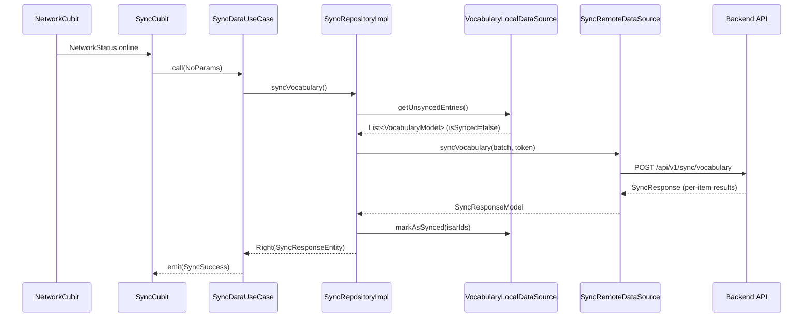

# UC09 — Background Sync Worker Implementation

## Summary

Implemented a fully automatic background sync system that detects internet connectivity and pushes all unsynced vocabulary records (`is_synced = false`) to the backend API, then marks them as synced on success.

## Architecture



## Files Created / Modified

### Backend (FastAPI)

| File | Action | Description |
|---|---|---|
| [sync.py](file:///c:/Users/minhk/Downloads/TranslationAppFlutter/backend/app/schemas/sync.py) | Created | Pydantic schemas for sync request/response |
| [sync_service.py](file:///c:/Users/minhk/Downloads/TranslationAppFlutter/backend/app/services/sync_service.py) | Created | Business logic with Last-Write-Wins strategy |
| [sync.py](file:///c:/Users/minhk/Downloads/TranslationAppFlutter/backend/app/api/v1/endpoints/sync.py) | Created | `POST /api/v1/sync/vocabulary` endpoint |
| [api.py](file:///c:/Users/minhk/Downloads/TranslationAppFlutter/backend/app/api/v1/api.py) | Modified | Registered sync router |

### Frontend (Flutter) — Clean Architecture

| Layer | File | Action | Description |
|---|---|---|---|
| **Domain** | [sync_entity.dart](file:///c:/Users/minhk/Downloads/TranslationAppFlutter/frontend/lib/features/sync/domain/entities/sync_entity.dart) | Created | `SyncResultEntity`, `SyncResponseEntity` |
| **Domain** | [sync_repository.dart](file:///c:/Users/minhk/Downloads/TranslationAppFlutter/frontend/lib/features/sync/domain/repositories/sync_repository.dart) | Created | Abstract `SyncRepository` interface |
| **Domain** | [sync_data_usecase.dart](file:///c:/Users/minhk/Downloads/TranslationAppFlutter/frontend/lib/features/sync/domain/usecases/sync_data_usecase.dart) | Created | `SyncDataUseCase` |
| **Data** | [sync_model.dart](file:///c:/Users/minhk/Downloads/TranslationAppFlutter/frontend/lib/features/sync/data/models/sync_model.dart) | Created | Request/Response DTOs |
| **Data** | [sync_remote_datasource.dart](file:///c:/Users/minhk/Downloads/TranslationAppFlutter/frontend/lib/features/sync/data/datasources/sync_remote_datasource.dart) | Created | HTTP client for sync API |
| **Data** | [sync_repository_impl.dart](file:///c:/Users/minhk/Downloads/TranslationAppFlutter/frontend/lib/features/sync/data/repositories/sync_repository_impl.dart) | Created | Implementation with exponential backoff |
| **Presentation** | [sync_state.dart](file:///c:/Users/minhk/Downloads/TranslationAppFlutter/frontend/lib/features/sync/presentation/bloc/sync_state.dart) | Created | `SyncIdle`, `SyncSyncing`, `SyncSuccess`, `SyncFailure` |
| **Presentation** | [sync_cubit.dart](file:///c:/Users/minhk/Downloads/TranslationAppFlutter/frontend/lib/features/sync/presentation/bloc/sync_cubit.dart) | Created | Background worker that listens to `NetworkCubit` |
| **DI** | [injection_container.dart](file:///c:/Users/minhk/Downloads/TranslationAppFlutter/frontend/lib/injection_container.dart) | Modified | Registered all sync dependencies |
| **App** | [main.dart](file:///c:/Users/minhk/Downloads/TranslationAppFlutter/frontend/lib/main.dart) | Modified | Added `SyncCubit` as global `BlocProvider` |

### Warning Fixes

| File | Issue | Fix |
|---|---|---|
| `lib/models/vocabulary_model.dart` | `dangling_library_doc_comments` | `///` → `//` |
| `lib/providers/vocabulary_providers.dart` | `dangling_library_doc_comments` | `///` → `//` |
| `lib/screens/vocabulary_screen.dart` | `dangling_library_doc_comments` | `///` → `//` |
| `lib/screens/vocabulary_screen.dart` | `unused_import` | Removed `vocabulary_service.dart` import |
| `lib/screens/vocabulary_screen.dart` | `use_super_parameters` | `Key? key` → `super.key` |
| `lib/screens/vocabulary_screen.dart` | `use_build_context_synchronously` | `mounted` → `context.mounted` |
| `lib/services/local_vocabulary_service.dart` | `dangling_library_doc_comments` | `///` → `//` |
| `lib/services/vocabulary_service.dart` | `dangling_library_doc_comments` | `///` → `//` |

## Key Design Decisions

1. **Exponential Backoff** (§5.3): Retries at 5s → 10s → 30s on server failures
2. **Last-Write-Wins** (§5.2): Server compares `updated_at` timestamps to resolve conflicts
3. **Auth failure = stop sync**: If token expires mid-sync, the cycle halts immediately (no infinite retry)
4. **Guard against overlap**: `_isSyncing` flag prevents concurrent sync cycles
5. **Global lifecycle**: `SyncCubit` lives for the entire app lifetime via `BlocProvider` in `main.dart`

## Analysis Result

```
flutter analyze → No issues found! (ran in 5.9s)
```
