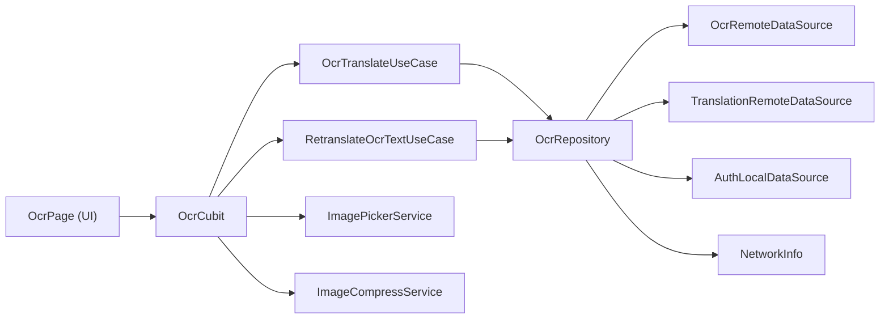

# 📸 Image Picker & Camera Integration — Summary

## Task
Tích hợp Camera & Thư viện ảnh (Image Picker) theo Clean Architecture cho tính năng OCR Translation (UC06).

## Architecture Overview

## Files Created / Modified

### Core Layer (New)
| File | Purpose |
|------|---------|
| [image_picker_service.dart](file:///c:/Users/minhk/Downloads/TranslationAppFlutter/frontend/lib/core/image_picker/image_picker_service.dart) | Abstraction over `image_picker` plugin — `ImagePickerService` interface + `ImagePickerServiceImpl` |
| [image_compress_service.dart](file:///c:/Users/minhk/Downloads/TranslationAppFlutter/frontend/lib/core/image_picker/image_compress_service.dart) | Abstraction over `flutter_image_compress` — `ImageCompressService` interface |

### Domain Layer (New/Updated)
| File | Purpose |
|------|---------|
| [ocr_entity.dart](file:///c:/Users/minhk/Downloads/TranslationAppFlutter/frontend/lib/features/ocr/domain/entities/ocr_entity.dart) | `OcrTranslationEntity` — pure Dart entity with Equatable |
| [ocr_repository.dart](file:///c:/Users/minhk/Downloads/TranslationAppFlutter/frontend/lib/features/ocr/domain/repositories/ocr_repository.dart) | Abstract `OcrRepository` using `Either<Failure, T>` |
| [ocr_translate_usecase.dart](file:///c:/Users/minhk/Downloads/TranslationAppFlutter/frontend/lib/features/ocr/domain/usecases/ocr_translate_usecase.dart) | `OcrTranslateUseCase` — extends `UseCase<T, P>` |
| [retranslate_ocr_text_usecase.dart](file:///c:/Users/minhk/Downloads/TranslationAppFlutter/frontend/lib/features/ocr/domain/usecases/retranslate_ocr_text_usecase.dart) | `RetranslateOcrTextUseCase` — re-translate edited OCR text |

### Data Layer (New/Updated)
| File | Purpose |
|------|---------|
| [ocr_repository_impl.dart](file:///c:/Users/minhk/Downloads/TranslationAppFlutter/frontend/lib/features/ocr/data/repositories/ocr_repository_impl.dart) | Full implementation with network check, auth token, exception→Failure conversion |
| [ocr_model.dart](file:///c:/Users/minhk/Downloads/TranslationAppFlutter/frontend/lib/features/ocr/data/models/ocr_model.dart) | DTO with `fromJson`/`toJson` |

### Presentation Layer (Updated)
| File | Purpose |
|------|---------|
| [ocr_cubit.dart](file:///c:/Users/minhk/Downloads/TranslationAppFlutter/frontend/lib/features/ocr/presentation/bloc/ocr_cubit.dart) | Refactored to use UseCases + core services instead of direct plugin access |
| [ocr_widgets.dart](file:///c:/Users/minhk/Downloads/TranslationAppFlutter/frontend/lib/features/ocr/presentation/widgets/ocr_widgets.dart) | New `ImageSourcePickerSheet` — reusable camera/gallery selector |

### DI & Config (Updated)
| File | Purpose |
|------|---------|
| [injection_container.dart](file:///c:/Users/minhk/Downloads/TranslationAppFlutter/frontend/lib/injection_container.dart) | Registered `ImagePickerService`, `ImageCompressService`, `OcrRepository`, UseCases |

### Platform Permissions (Updated)
| File | Changes |
|------|---------|
| [AndroidManifest.xml](file:///c:/Users/minhk/Downloads/TranslationAppFlutter/frontend/android/app/src/main/AndroidManifest.xml) | Added `CAMERA`, `READ_EXTERNAL_STORAGE`, `WRITE_EXTERNAL_STORAGE`, `READ_MEDIA_IMAGES` |
| [Info.plist](file:///c:/Users/minhk/Downloads/TranslationAppFlutter/frontend/ios/Runner/Info.plist) | Added `NSCameraUsageDescription`, `NSPhotoLibraryUsageDescription`, `NSMicrophoneUsageDescription` |

## Key Design Decisions

1. **Service abstractions in `core/`** — `ImagePickerService` and `ImageCompressService` wrap Flutter plugins behind interfaces, keeping Cubits/UseCases testable without mock plugins.

2. **Full Clean Architecture for OCR** — Previously, `OcrCubit` directly called `ImagePicker` and `OcrRemoteDataSource`. Now follows the proper flow: `UI → Cubit → UseCase → Repository → DataSource`.

3. **`Either<Failure, T>` throughout** — All repository and use case methods return `Either` per project rules (§3.2). Exceptions are caught at the repository layer.

4. **Android permission scoping** — Uses `android:maxSdkVersion` to scope legacy `READ_EXTERNAL_STORAGE` (≤API 32) and `WRITE_EXTERNAL_STORAGE` (≤API 28), with `READ_MEDIA_IMAGES` for Android 13+.

5. **Image compression threshold** — Images > 1.5 MB are auto-compressed to stay under the 5 MB server limit (§7.2).

## Analysis Result
✅ **0 new issues** introduced — all 4 remaining warnings are pre-existing in unrelated files.
