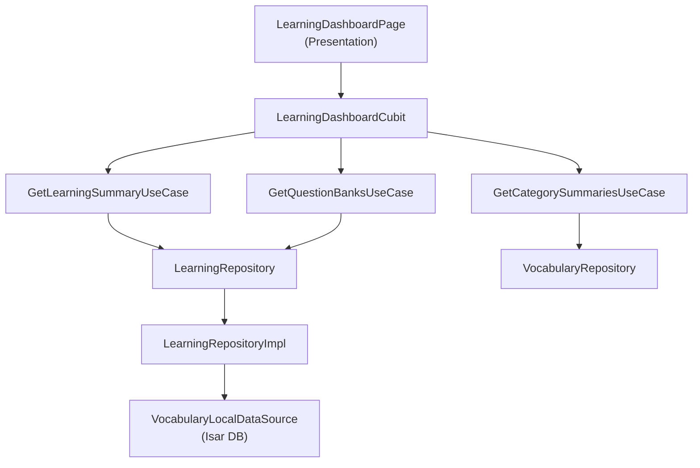

# Learning Dashboard & Danh sách Đề thi — Implementation Summary

## Overview
Xây dựng giao diện **Learning Dashboard** hiển thị danh sách từ vựng cá nhân và các bộ đề trắc nghiệm có sẵn, theo **Clean Architecture** với **BLoC/Cubit** pattern.

## Architecture

## Files Created

### Domain Layer
| File | Purpose |
|------|---------|
| [learning_summary_entity.dart](file:///c:/Users/minhk/Downloads/TranslationAppFlutter/frontend/lib/features/learning/domain/entities/learning_summary_entity.dart) | Aggregated learning stats (total/learned words, quiz count, avg score) |
| [question_bank_entity.dart](file:///c:/Users/minhk/Downloads/TranslationAppFlutter/frontend/lib/features/learning/domain/entities/question_bank_entity.dart) | Question bank overview info (title, questions, duration) |
| [learning_repository.dart](file:///c:/Users/minhk/Downloads/TranslationAppFlutter/frontend/lib/features/learning/domain/repositories/learning_repository.dart) | Abstract repository interface |
| [get_learning_summary_usecase.dart](file:///c:/Users/minhk/Downloads/TranslationAppFlutter/frontend/lib/features/learning/domain/usecases/get_learning_summary_usecase.dart) | Use case for fetching learning summary |
| [get_question_banks_usecase.dart](file:///c:/Users/minhk/Downloads/TranslationAppFlutter/frontend/lib/features/learning/domain/usecases/get_question_banks_usecase.dart) | Use case for fetching question banks |

### Data Layer
| File | Purpose |
|------|---------|
| [learning_repository_impl.dart](file:///c:/Users/minhk/Downloads/TranslationAppFlutter/frontend/lib/features/learning/data/repositories/learning_repository_impl.dart) | Offline-first impl, reuses VocabularyLocalDataSource |

### Presentation Layer
| File | Purpose |
|------|---------|
| [learning_dashboard_cubit.dart](file:///c:/Users/minhk/Downloads/TranslationAppFlutter/frontend/lib/features/learning/presentation/bloc/learning_dashboard_cubit.dart) | Cubit: Loading → Loaded/Failure states |
| [learning_dashboard_state.dart](file:///c:/Users/minhk/Downloads/TranslationAppFlutter/frontend/lib/features/learning/presentation/bloc/learning_dashboard_state.dart) | Sealed state classes with Equatable |
| [learning_dashboard_page.dart](file:///c:/Users/minhk/Downloads/TranslationAppFlutter/frontend/lib/features/learning/presentation/pages/learning_dashboard_page.dart) | Main page with BlocProvider, loading skeleton, pull-to-refresh |
| [learning_summary_card.dart](file:///c:/Users/minhk/Downloads/TranslationAppFlutter/frontend/lib/features/learning/presentation/widgets/learning_summary_card.dart) | Gradient card with animated progress ring |
| [category_progress_list.dart](file:///c:/Users/minhk/Downloads/TranslationAppFlutter/frontend/lib/features/learning/presentation/widgets/category_progress_list.dart) | Horizontal scrollable category cards |
| [question_bank_card.dart](file:///c:/Users/minhk/Downloads/TranslationAppFlutter/frontend/lib/features/learning/presentation/widgets/question_bank_card.dart) | Exam card with info chips + "Bắt đầu" button |

### Modified Files

| File | Change |
|------|--------|
| [injection_container.dart](file:///c:/Users/minhk/Downloads/TranslationAppFlutter/frontend/lib/injection_container.dart) | Registered `LearningRepository`, 2 use cases, `LearningDashboardCubit` |
| [app_router.dart](file:///c:/Users/minhk/Downloads/TranslationAppFlutter/frontend/lib/core/router/app_router.dart) | Added `/learning` route as public page |
| [translation_page.dart](file:///c:/Users/minhk/Downloads/TranslationAppFlutter/frontend/lib/features/translation/presentation/pages/translation_page.dart) | Added 4th "Học tập" tab in NavigationBar |

## UI Components

### 1. Learning Summary Card (Header)
- Gradient background (blue tones matching AppTheme)
- Animated circular progress ring showing vocabulary mastery %
- 4 stat items: Total words, Learned, Quizzes completed, Avg score
- Motivational subtitle changes based on progress level

### 2. Category Progress List
- Horizontal scrollable cards
- Each card: category name, word count, progress bar
- Rotating accent color palette for visual distinction
- Empty state placeholder when no categories exist

### 3. Question Bank Cards (Exam List)
- Left accent gradient bar (blue → cyan)
- Title + description
- Info chips: question count, time limit
- Gradient "Bắt đầu" (Start) button with arrow icon
- Empty state when no banks are synced

## Navigation
- **Bottom tab**: 4th tab "Học tập" with `Icons.school_rounded`
- **Direct route**: `/learning` (public, no auth required)

> [!NOTE]
> The "Bắt đầu" button currently shows a SnackBar. You'll need to implement the actual quiz-taking page and wire up the navigation in a follow-up task.
