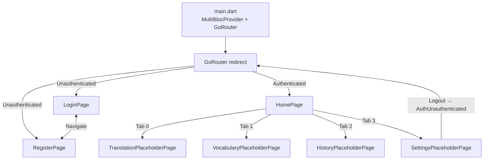

# 🧭 Navigation & Placeholder Screens — Summary

## Kiến trúc đã triển khai



## Files đã tạo/sửa

| File | Action | Mô tả |
|---|---|---|
| [app_router.dart](file:///c:/Users/minhk/Downloads/TranslationAppFlutter/frontend/lib/core/router/app_router.dart) | **Tạo mới** | GoRouter config với auth redirect + `GoRouterRefreshStream` |
| [app_theme.dart](file:///c:/Users/minhk/Downloads/TranslationAppFlutter/frontend/lib/core/theme/app_theme.dart) | **Tạo mới** | Material 3 theme (light/dark) với `ColorScheme.fromSeed` |
| [home_page.dart](file:///c:/Users/minhk/Downloads/TranslationAppFlutter/frontend/lib/features/home/presentation/pages/home_page.dart) | **Tạo mới** | Bottom navigation 4 tabs (Dịch, Từ vựng, Lịch sử, Cài đặt) |
| [settings_page.dart](file:///c:/Users/minhk/Downloads/TranslationAppFlutter/frontend/lib/features/home/presentation/pages/settings_page.dart) | **Tạo mới** | Settings placeholder với user info + logout |
| [login_page.dart](file:///c:/Users/minhk/Downloads/TranslationAppFlutter/frontend/lib/features/auth/presentation/pages/login_page.dart) | **Cập nhật** | Login form với BlocConsumer + exhaustive state handling |
| [register_page.dart](file:///c:/Users/minhk/Downloads/TranslationAppFlutter/frontend/lib/features/auth/presentation/pages/register_page.dart) | **Cập nhật** | Register form với name/email/password/confirm |
| [translation_page.dart](file:///c:/Users/minhk/Downloads/TranslationAppFlutter/frontend/lib/features/translation/presentation/pages/translation_page.dart) | **Cập nhật** | Translation placeholder với language selector + input/output areas |
| [vocabulary_page.dart](file:///c:/Users/minhk/Downloads/TranslationAppFlutter/frontend/lib/features/vocabulary/presentation/pages/vocabulary_page.dart) | **Cập nhật** | Vocabulary empty state placeholder |
| [history_page.dart](file:///c:/Users/minhk/Downloads/TranslationAppFlutter/frontend/lib/features/history/presentation/pages/history_page.dart) | **Cập nhật** | History empty state placeholder |
| [main.dart](file:///c:/Users/minhk/Downloads/TranslationAppFlutter/frontend/lib/main.dart) | **Cập nhật** | Wired MultiBlocProvider + GoRouter + Theme + Stub use cases |

## Tuân thủ quy tắc

| Quy tắc | Tuân thủ |
|---|---|
| Clean Architecture layers (Presentation → Domain → Data) | ✅ |
| Bloc/Cubit cho state management (§3.1) | ✅ AuthCubit global |
| `Either<Failure, T>` error handling (§3.2) | ✅ Stub use cases |
| GoRouter cho navigation (flutter-instruction) | ✅ Auth redirect |
| Exhaustive switch trên sealed state (BLoC rules) | ✅ Login/Register |
| BlocConsumer cho UI + side effects (§BLoC Flutter) | ✅ |
| ReadCubits global, WriteCubits local (§1.4) | ✅ AuthCubit ở app level |
| Material 3 theme + light/dark (flutter-instruction) | ✅ |
| No business logic in Presentation (§1.1) | ✅ |

## Stub use cases

> [!IMPORTANT]
> `main.dart` chứa **stub use cases** tạm thời để app có thể chạy và test navigation flow. Khi DI container (`injection_container.dart`) được wire hoàn chỉnh, hãy thay thế bằng:
> ```dart
> loginUseCase: sl<LoginUseCase>(),
> registerUseCase: sl<RegisterUseCase>(),
> ```

## Bước tiếp theo

1. **Wire DI container** — Kết nối thật `LoginUseCase`, `RegisterUseCase` với backend
2. **Implement Translation feature** — BlocBuilder với debounce 500ms
3. **Implement Vocabulary/History** — ListView.builder + Isar DB offline-first
4. **Implement Settings** — Language, theme, sync configuration
