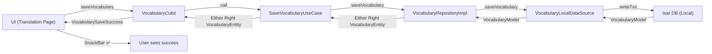
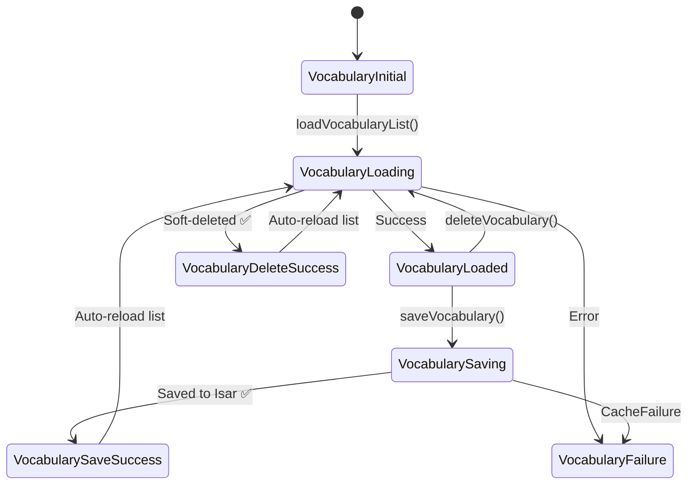

# Offline-First Vocabulary (Isar DB) — Implementation Summary

## Task
Hoàn thiện logic offline-first: Khi User nhấn **"Lưu từ vựng"**, dữ liệu phải được lưu vào **Isar DB (Local)** trước, hiển thị thành công ngay lập tức, đồng thời đánh dấu `isSynced = false`.

## Architecture Flow



## State Flow



## Files Changed / Created

### New Files (7)

| Layer | File | Purpose |
|-------|------|---------|
| Data | [vocabulary_local_datasource.dart](file:///c:/Users/minhk/Downloads/TranslationAppFlutter/frontend/lib/features/vocabulary/data/datasources/vocabulary_local_datasource.dart) | Isar CRUD operations with `isSynced`/`isDeleted` |
| Data | [vocabulary_repository_impl.dart](file:///c:/Users/minhk/Downloads/TranslationAppFlutter/frontend/lib/features/vocabulary/data/repositories/vocabulary_repository_impl.dart) | Offline-first repo — all ops go to Isar local |
| Domain | [save_vocabulary_usecase.dart](file:///c:/Users/minhk/Downloads/TranslationAppFlutter/frontend/lib/features/vocabulary/domain/usecases/save_vocabulary_usecase.dart) | UC07 — Save entry to Isar with `isSynced=false` |
| Domain | [get_vocabulary_list_usecase.dart](file:///c:/Users/minhk/Downloads/TranslationAppFlutter/frontend/lib/features/vocabulary/domain/usecases/get_vocabulary_list_usecase.dart) | UC08 — Read from Isar (offline-first) |
| Domain | [delete_vocabulary_usecase.dart](file:///c:/Users/minhk/Downloads/TranslationAppFlutter/frontend/lib/features/vocabulary/domain/usecases/delete_vocabulary_usecase.dart) | Soft-delete: `isDeleted=true`, `isSynced=false` |
| Presentation | [vocabulary_state.dart](file:///c:/Users/minhk/Downloads/TranslationAppFlutter/frontend/lib/features/vocabulary/presentation/bloc/vocabulary_state.dart) | Sealed state classes |
| Presentation | [vocabulary_cubit.dart](file:///c:/Users/minhk/Downloads/TranslationAppFlutter/frontend/lib/features/vocabulary/presentation/bloc/vocabulary_cubit.dart) | Cubit with save/load/delete |

### Modified Files (4)

| File | Changes |
|------|---------|
| [vocabulary_entity.dart](file:///c:/Users/minhk/Downloads/TranslationAppFlutter/frontend/lib/features/vocabulary/domain/entities/vocabulary_entity.dart) | Added `isarId` field for local DB delete operations |
| [vocabulary_model.dart](file:///c:/Users/minhk/Downloads/TranslationAppFlutter/frontend/lib/features/vocabulary/data/models/vocabulary_model.dart) | Updated `toEntity()` to include `isarId` |
| [injection_container.dart](file:///c:/Users/minhk/Downloads/TranslationAppFlutter/frontend/lib/injection_container.dart) | Registered all vocabulary DI dependencies |
| [translation_page.dart](file:///c:/Users/minhk/Downloads/TranslationAppFlutter/frontend/lib/features/translation/presentation/pages/translation_page.dart) | Wired save button → `VocabularyCubit`, added `BlocListener` for success/error feedback |
| [vocabulary_page.dart](file:///c:/Users/minhk/Downloads/TranslationAppFlutter/frontend/lib/features/vocabulary/presentation/pages/vocabulary_page.dart) | Full implementation replacing placeholder — list view with cards, TTS, soft-delete |

## Key Design Decisions

> [!IMPORTANT]
> **Offline-first pattern**: All writes go to Isar first with `isSynced = false`. The sync feature (UC09) will later push unsynced entries to the server.

> [!NOTE]
> **Soft delete only**: Per business rules (§5.4), no physical `isar.delete()` is used. Instead, `isDeleted = true` + `isSynced = false` to ensure the deletion syncs to the server.

> [!TIP]
> **Temporary IDs**: Local entries get a `local_<timestamp>` backend ID. The sync feature should replace this with the server-assigned UUID after successful sync.

## Analysis Result
```
flutter analyze → 0 errors, 0 warnings (in new code)
```
