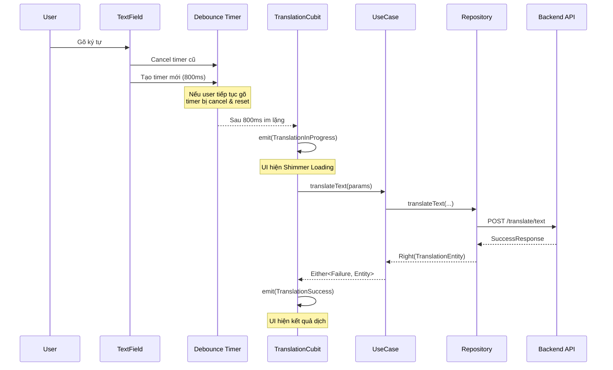

# Tích hợp API Dịch & Xử lý Trạng thái — Tổng kết

## Tổng quan thay đổi

Task này triển khai 3 yêu cầu chính cho feature Translation:

1. **Gọi API `/translate/text`** từ Backend
2. **Hiệu ứng Shimmer Loading** khi đang chờ dịch
3. **Cơ chế Debounce 800ms** (trong khoảng 500ms–1s theo business rules)

---

## 1. API Integration — `/translate/text`

### Vấn đề trước đó
- Remote DataSource gọi sai endpoint: `POST /translate` thay vì `POST /translate/text`
- Không xử lý response wrapper `SuccessResponse` từ backend: `{ "status": "success", "data": {...} }`
- Error parsing đơn giản, không xử lý nested error format

### Thay đổi

#### [translation_remote_datasource.dart](file:///c:/Users/minhk/Downloads/TranslationAppFlutter/frontend/lib/features/translation/data/datasources/translation_remote_datasource.dart)
```diff:translation_remote_datasource.dart
import 'dart:convert';

import 'package:http/http.dart' as http;

import 'package:frontend/core/error/exceptions.dart';
import 'package:frontend/features/translation/data/models/translation_model.dart';

/// Abstract interface for remote translation API.
abstract class TranslationRemoteDataSource {
  /// Calls `POST /api/v1/translate`.
  /// Throws [ServerException] on non-200 responses or timeout.
  Future<TranslationModel> translateText({
    required String text,
    required String sourceLanguage,
    required String targetLanguage,
  });
}

class TranslationRemoteDataSourceImpl implements TranslationRemoteDataSource {
  final http.Client client;
  final String baseUrl;

  const TranslationRemoteDataSourceImpl({
    required this.client,
    required this.baseUrl,
  });

  @override
  Future<TranslationModel> translateText({
    required String text,
    required String sourceLanguage,
    required String targetLanguage,
  }) async {
    final response = await client
        .post(
          Uri.parse('$baseUrl/translate'),
          headers: {'Content-Type': 'application/json'},
          body: jsonEncode({
            'text': text,
            'source_language': sourceLanguage,
            'target_language': targetLanguage,
          }),
        )
        .timeout(
          const Duration(seconds: 10),
          onTimeout: () => throw const ServerException(
            message: 'Yêu cầu hết thời gian, vui lòng thử lại.',
          ),
        );

    if (response.statusCode == 200) {
      final body = jsonDecode(response.body) as Map<String, dynamic>;
      return TranslationModel.fromJson(body);
    }

    Map<String, dynamic> errorBody;
    try {
      errorBody = jsonDecode(response.body) as Map<String, dynamic>;
    } catch (_) {
      errorBody = {'detail': response.body};
    }

    throw ServerException(
      message:
          errorBody['detail'] as String? ??
          'Lỗi máy chủ ${response.statusCode}',
      statusCode: response.statusCode,
    );
  }
}
===
import 'dart:convert';

import 'package:http/http.dart' as http;

import 'package:frontend/core/error/exceptions.dart';
import 'package:frontend/features/translation/data/models/translation_model.dart';

/// Abstract interface for remote translation API.
abstract class TranslationRemoteDataSource {
  /// Calls `POST /api/v1/translate`.
  /// Throws [ServerException] on non-200 responses or timeout.
  Future<TranslationModel> translateText({
    required String text,
    required String sourceLanguage,
    required String targetLanguage,
  });
}

class TranslationRemoteDataSourceImpl implements TranslationRemoteDataSource {
  final http.Client client;
  final String baseUrl;

  const TranslationRemoteDataSourceImpl({
    required this.client,
    required this.baseUrl,
  });

  @override
  Future<TranslationModel> translateText({
    required String text,
    required String sourceLanguage,
    required String targetLanguage,
  }) async {
    final response = await client
        .post(
          Uri.parse('$baseUrl/translate/text'),
          headers: {'Content-Type': 'application/json'},
          body: jsonEncode({
            'text': text,
            'source_language': sourceLanguage,
            'target_language': targetLanguage,
          }),
        )
        .timeout(
          const Duration(seconds: 10),
          onTimeout: () => throw const ServerException(
            message: 'Yêu cầu hết thời gian, vui lòng thử lại.',
          ),
        );

    if (response.statusCode == 200) {
      final body = jsonDecode(response.body) as Map<String, dynamic>;

      // Backend wraps responses in SuccessResponse:
      // { "status": "success", "data": { ... } }
      final data = (body['data'] as Map<String, dynamic>?) ?? body;
      return TranslationModel.fromJson(data);
    }

    // Parse error detail from backend error response format:
    // { "detail": { "status": "error", "code": "...", "message": "..." } }
    // or { "detail": "simple string" }
    Map<String, dynamic> errorBody;
    try {
      final decoded = jsonDecode(response.body);
      if (decoded is Map<String, dynamic>) {
        errorBody = decoded;
      } else {
        errorBody = {'detail': response.body};
      }
    } catch (_) {
      errorBody = {'detail': response.body};
    }

    String errorMessage;
    final detail = errorBody['detail'];
    if (detail is Map<String, dynamic>) {
      errorMessage =
          detail['message'] as String? ??
          'Lỗi máy chủ ${response.statusCode}';
    } else if (detail is String) {
      errorMessage = detail;
    } else {
      errorMessage = 'Lỗi máy chủ ${response.statusCode}';
    }

    throw ServerException(
      message: errorMessage,
      statusCode: response.statusCode,
    );
  }
}
```

> [!IMPORTANT]
> Endpoint đã chuyển từ `$baseUrl/translate` → `$baseUrl/translate/text` để khớp với backend router `prefix="/translate"` + route `"/text"`.

#### [translation_model.dart](file:///c:/Users/minhk/Downloads/TranslationAppFlutter/frontend/lib/features/translation/data/models/translation_model.dart)
```diff:translation_model.dart
import 'package:frontend/features/translation/domain/entities/translation_entity.dart';

/// DTO for translation API responses.
/// Extends [TranslationEntity] so it can be used directly where an entity
/// is expected, and provides fromJson/toEntity helpers.
class TranslationModel extends TranslationEntity {
  const TranslationModel({
    required super.id,
    required super.sourceText,
    required super.translatedText,
    required super.sourceLanguage,
    required super.targetLanguage,
    required super.createdAt,
    required super.updatedAt,
    super.isSynced,
    super.isDeleted,
  });

  factory TranslationModel.fromJson(Map<String, dynamic> json) {
    return TranslationModel(
      id: json['id']?.toString() ?? '',
      sourceText: (json['sourceText'] ?? json['source_text'] ?? '') as String,
      translatedText:
          (json['translatedText'] ?? json['translated_text'] ?? '') as String,
      sourceLanguage:
          (json['sourceLanguage'] ?? json['source_language'] ?? '') as String,
      targetLanguage:
          (json['targetLanguage'] ?? json['target_language'] ?? '') as String,
      createdAt: json['createdAt'] != null
          ? DateTime.parse(json['createdAt'] as String)
          : DateTime.now(),
      updatedAt: json['updatedAt'] != null
          ? DateTime.parse(json['updatedAt'] as String)
          : DateTime.now(),
      isSynced: (json['isSynced'] ?? json['is_synced'] ?? false) as bool,
      isDeleted: (json['isDeleted'] ?? json['is_deleted'] ?? false) as bool,
    );
  }

  Map<String, dynamic> toJson() => {
    'id': id,
    'sourceText': sourceText,
    'translatedText': translatedText,
    'sourceLanguage': sourceLanguage,
    'targetLanguage': targetLanguage,
    'createdAt': createdAt.toIso8601String(),
    'updatedAt': updatedAt.toIso8601String(),
    'isSynced': isSynced,
    'isDeleted': isDeleted,
  };

  TranslationEntity toEntity() => TranslationEntity(
    id: id,
    sourceText: sourceText,
    translatedText: translatedText,
    sourceLanguage: sourceLanguage,
    targetLanguage: targetLanguage,
    createdAt: createdAt,
    updatedAt: updatedAt,
    isSynced: isSynced,
    isDeleted: isDeleted,
  );
}
===
import 'package:frontend/features/translation/domain/entities/translation_entity.dart';

/// DTO for translation API responses.
/// Extends [TranslationEntity] so it can be used directly where an entity
/// is expected, and provides fromJson/toEntity helpers.
class TranslationModel extends TranslationEntity {
  const TranslationModel({
    required super.id,
    required super.sourceText,
    required super.translatedText,
    required super.sourceLanguage,
    required super.targetLanguage,
    required super.createdAt,
    required super.updatedAt,
    super.isSynced,
    super.isDeleted,
  });

  /// Parses a JSON map into a [TranslationModel].
  ///
  /// Handles both camelCase (Dart convention) and snake_case
  /// (backend convention from `/translate/text`).
  factory TranslationModel.fromJson(Map<String, dynamic> json) {
    return TranslationModel(
      id: json['id']?.toString() ?? '',
      sourceText:
          (json['source_text'] ?? json['sourceText'] ?? '') as String,
      translatedText:
          (json['translated_text'] ?? json['translatedText'] ?? '') as String,
      sourceLanguage:
          (json['source_language'] ?? json['sourceLanguage'] ?? '') as String,
      targetLanguage:
          (json['target_language'] ?? json['targetLanguage'] ?? '') as String,
      createdAt: _parseDateTime(json['created_at'] ?? json['createdAt']),
      updatedAt: _parseDateTime(json['updated_at'] ?? json['updatedAt']),
      isSynced: (json['is_synced'] ?? json['isSynced'] ?? false) as bool,
      isDeleted: (json['is_deleted'] ?? json['isDeleted'] ?? false) as bool,
    );
  }

  /// Safely parses a datetime value that may be null or a string.
  static DateTime _parseDateTime(dynamic value) {
    if (value == null) return DateTime.now();
    if (value is String) return DateTime.parse(value);
    return DateTime.now();
  }

  Map<String, dynamic> toJson() => {
    'id': id,
    'sourceText': sourceText,
    'translatedText': translatedText,
    'sourceLanguage': sourceLanguage,
    'targetLanguage': targetLanguage,
    'createdAt': createdAt.toIso8601String(),
    'updatedAt': updatedAt.toIso8601String(),
    'isSynced': isSynced,
    'isDeleted': isDeleted,
  };

  TranslationEntity toEntity() => TranslationEntity(
    id: id,
    sourceText: sourceText,
    translatedText: translatedText,
    sourceLanguage: sourceLanguage,
    targetLanguage: targetLanguage,
    createdAt: createdAt,
    updatedAt: updatedAt,
    isSynced: isSynced,
    isDeleted: isDeleted,
  );
}
```

> [!NOTE]
> `fromJson` giờ ưu tiên snake_case keys (`source_text`, `translated_text`) vì đó là format trả về từ backend. Vẫn hỗ trợ camelCase để tương thích ngược.

---

## 2. Shimmer Loading Effect

### Package thêm mới
```yaml
# pubspec.yaml - Shimmer animation effect for loading states
shimmer: ^3.0.0
```

### Widget mới tạo
#### [shimmer_loading_widget.dart](file:///c:/Users/minhk/Downloads/TranslationAppFlutter/frontend/lib/features/translation/presentation/widgets/shimmer_loading_widget.dart)

Hai widget được cung cấp:
- `ShimmerTranslationLoading` — Full-size cho trang dịch chính (4 dòng shimmer)
- `ShimmerTranslationLoadingCompact` — Compact cho QuickTranslate widget (2 dòng shimmer)

**Đặc điểm:**
- Tự động thích ứng light/dark theme
- Độ rộng các dòng khác nhau (100%, 75%, 45%) tạo hiệu ứng tự nhiên
- Animation period: 1500ms cho hiệu ứng mượt mà
- Hỗ trợ `compact` mode cho widget nhỏ

### Các file đã cập nhật

#### [translation_page.dart](file:///c:/Users/minhk/Downloads/TranslationAppFlutter/frontend/lib/features/translation/presentation/pages/translation_page.dart)
- Widget `_ResultLoading` giờ dùng `ShimmerTranslationLoading` thay vì static containers

#### [translation_widgets.dart](file:///c:/Users/minhk/Downloads/TranslationAppFlutter/frontend/lib/features/translation/presentation/widgets/translation_widgets.dart)
- `QuickTranslateWidget` loading state dùng `ShimmerTranslationLoadingCompact` thay vì `LinearProgressIndicator`

---

## 3. Debounce Mechanism

### Đã triển khai sẵn — điều chỉnh thời gian

Cơ chế debounce đã được triển khai từ trước bằng `dart:async` Timer. Thay đổi duy nhất:

```diff
- _debounce = Timer(const Duration(milliseconds: 500), () {
+ _debounce = Timer(const Duration(milliseconds: 800), () {
```

> [!TIP]
> Thời gian 800ms nằm trong khoảng 500ms–1s theo yêu cầu business (`copilot-instructions §3.4`), cân bằng giữa responsiveness và giảm API calls không cần thiết.

### Flow hoạt động


---

## Kiến trúc tuân thủ

| Layer | Component | Trách nhiệm |
|-------|-----------|--------------|
| **Presentation** | `TranslationPage` | UI + Debounce Timer + Shimmer |
| **Presentation** | `TranslationCubit` | State management (Loading → Success/Failure) |
| **Domain** | `TranslateTextUseCase` | Business logic delegation |
| **Domain** | `TranslationRepository` (interface) | Contract definition |
| **Data** | `TranslationRepositoryImpl` | Error handling + network check |
| **Data** | `TranslationRemoteDataSource` | HTTP call to `/translate/text` |
| **Data** | `TranslationModel` | JSON parsing + entity mapping |

> [!NOTE]
> Kiến trúc tuân thủ đầy đủ flow `UI → Cubit → UseCase → Repository → DataSource` theo Clean Architecture rules.
