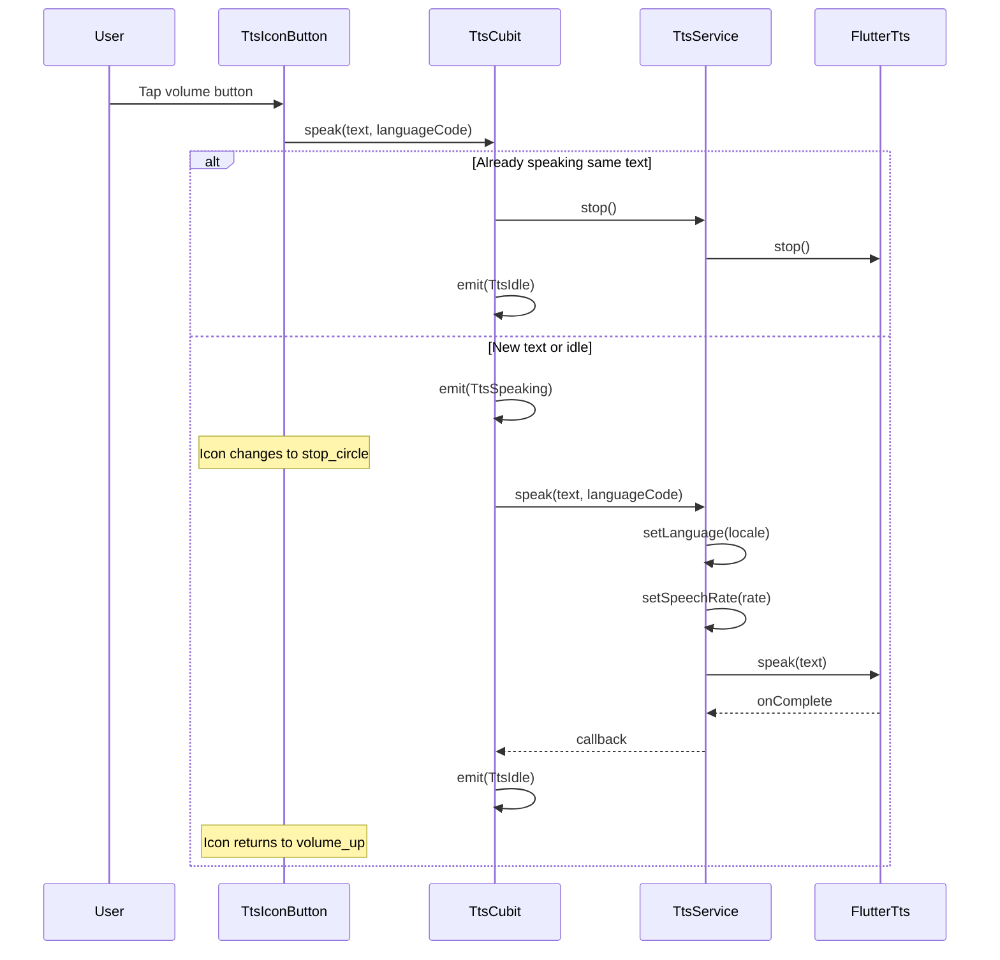

# Tích hợp Text-to-Speech (TTS) — Tổng kết

## Tổng quan

Tích hợp tính năng **Phát âm văn bản** (Text-to-Speech) cho cả văn bản nguồn và văn bản dịch. Giọng đọc được tự động cấu hình theo ngôn ngữ đã chọn.

---

## Kiến trúc file mới

```
lib/
├── core/
│   └── tts/                          ← NEW: Shared TTS module
│       ├── tts_service.dart          ← Service abstraction + FlutterTts impl
│       ├── bloc/
│       │   ├── tts_cubit.dart        ← State management
│       │   └── tts_state.dart        ← TtsIdle | TtsSpeaking | TtsFailure
│       └── widgets/
│           └── tts_icon_button.dart  ← Reusable UI component
```

> [!NOTE]
> TTS được đặt trong `core/` (không phải `features/`) vì đây là utility dùng chung cho nhiều features: translation, vocabulary, history.

---

## 1. Core Service — `TtsService`

[tts_service.dart](file:///c:/Users/minhk/Downloads/TranslationAppFlutter/frontend/lib/core/tts/tts_service.dart)

### Cấu hình giọng đọc theo ngôn ngữ

| Language Code | BCP-47 Locale | Speech Rate | Ghi chú |
|:---:|:---:|:---:|---|
| `en` | `en-US` | 0.45 | Giọng Mỹ |
| `vi` | `vi-VN` | 0.45 | Giọng Việt Nam |
| `fr` | `fr-FR` | 0.42 | Giọng Pháp |
| `ja` | `ja-JP` | 0.40 | Chậm hơn cho tiếng Nhật |
| `ko` | `ko-KR` | 0.42 | Giọng Hàn |
| `zh` | `zh-CN` | 0.40 | Chậm hơn cho tiếng Trung |
| `de` | `de-DE` | 0.42 | Giọng Đức |
| `es` | `es-ES` | 0.45 | Giọng Tây Ban Nha |

### Thiết kế
- **Abstract interface** `TtsService` → testable, có thể mock
- **Concrete impl** `TtsServiceImpl` wraps `FlutterTts`
- Auto-stops trước khi speak text mới (tránh overlap)
- Fallback `en-US` nếu language code không được hỗ trợ

---

## 2. State Management — `TtsCubit`

[tts_cubit.dart](file:///c:/Users/minhk/Downloads/TranslationAppFlutter/frontend/lib/core/tts/bloc/tts_cubit.dart) | [tts_state.dart](file:///c:/Users/minhk/Downloads/TranslationAppFlutter/frontend/lib/core/tts/bloc/tts_state.dart)

### States (sealed class)
```dart
sealed class TtsState
├── TtsIdle          // Không đang phát
├── TtsSpeaking      // Đang phát (text + languageCode)
└── TtsFailure       // Lỗi TTS engine
```

### Toggle behavior
- Nhấn button lần 1 → **phát âm** (emit `TtsSpeaking`)
- Nhấn button lần 2 (cùng text) → **dừng** (emit `TtsIdle`)
- Nhấn button khác khi đang phát → **dừng cũ + phát mới**

### Singleton registration
```dart
// injection_container.dart
sl.registerLazySingleton<TtsService>(() => TtsServiceImpl());
sl.registerLazySingleton<TtsCubit>(() => TtsCubit(ttsService: sl()));
```

> [!IMPORTANT]
> `TtsCubit` là **LazySingleton** (không phải Factory) vì chỉ cần 1 TTS instance cho toàn app. Điều này đảm bảo không có 2 giọng đọc overlap cùng lúc.

---

## 3. Reusable Widget — `TtsIconButton`

[tts_icon_button.dart](file:///c:/Users/minhk/Downloads/TranslationAppFlutter/frontend/lib/core/tts/widgets/tts_icon_button.dart)

- Icon animation: `volume_up_outlined` ↔ `stop_circle_outlined`
- `BlocBuilder` với `buildWhen` tối ưu — chỉ rebuild khi state thay đổi cho **đúng** text+language combo của button đó
- Hỗ trợ custom color, size, tooltip

---

## 4. UI Integration

### TranslationPage
```diff:translation_page.dart
import 'dart:async';

import 'package:flutter/material.dart';
import 'package:flutter/services.dart';
import 'package:flutter_bloc/flutter_bloc.dart';

import 'package:frontend/injection_container.dart';
import 'package:frontend/core/theme/app_theme.dart';
import 'package:frontend/features/translation/presentation/bloc/translation_cubit.dart';
import 'package:frontend/features/translation/presentation/bloc/translation_state.dart';

// ---------------------------------------------------------------------------
// Language model
// ---------------------------------------------------------------------------

class _Lang {
  final String code;
  final String name;
  final String flag;

  const _Lang({required this.code, required this.name, required this.flag});
}

const _kLangs = [
  _Lang(code: 'auto', name: 'Tự động', flag: '🔍'),
  _Lang(code: 'en', name: 'Tiếng Anh', flag: '🇺🇸'),
  _Lang(code: 'vi', name: 'Tiếng Việt', flag: '🇻🇳'),
  _Lang(code: 'fr', name: 'Tiếng Pháp', flag: '🇫🇷'),
  _Lang(code: 'ja', name: 'Tiếng Nhật', flag: '🇯🇵'),
  _Lang(code: 'ko', name: 'Tiếng Hàn', flag: '🇰🇷'),
  _Lang(code: 'zh', name: 'Tiếng Trung', flag: '🇨🇳'),
  _Lang(code: 'de', name: 'Tiếng Đức', flag: '🇩🇪'),
  _Lang(code: 'es', name: 'Tiếng Tây Ban Nha', flag: '🇪🇸'),
];

_Lang _findLang(String code) =>
    _kLangs.firstWhere((l) => l.code == code, orElse: () => _kLangs[1]);

// ---------------------------------------------------------------------------
// Entry point — wraps page in BlocProvider
// ---------------------------------------------------------------------------

class TranslationPage extends StatelessWidget {
  const TranslationPage({super.key});

  @override
  Widget build(BuildContext context) {
    return BlocProvider(
      create: (_) => sl<TranslationCubit>(),
      child: const _TranslationView(),
    );
  }
}

// ---------------------------------------------------------------------------
// Main view
// ---------------------------------------------------------------------------

class _TranslationView extends StatefulWidget {
  const _TranslationView();

  @override
  State<_TranslationView> createState() => _TranslationViewState();
}

class _TranslationViewState extends State<_TranslationView>
    with SingleTickerProviderStateMixin {
  final _controller = TextEditingController();
  Timer? _debounce;
  String _srcCode = 'auto';
  String _tgtCode = 'vi';
  late AnimationController _swapAnim;

  @override
  void initState() {
    super.initState();
    _swapAnim = AnimationController(
      vsync: this,
      duration: const Duration(milliseconds: 300),
    );
  }

  @override
  void dispose() {
    _controller.dispose();
    _debounce?.cancel();
    _swapAnim.dispose();
    super.dispose();
  }

  // ---- helpers ----

  TranslationCubit get _cubit => context.read<TranslationCubit>();

  void _onTextChanged(String value) {
    _debounce?.cancel();
    if (value.trim().isEmpty) {
      _cubit.reset();
      return;
    }
    _debounce = Timer(const Duration(milliseconds: 500), () {
      _cubit.translateText(
        text: value.trim(),
        sourceLanguage: _srcCode,
        targetLanguage: _tgtCode,
      );
    });
  }

  void _swapLanguages() {
    if (_srcCode == 'auto') return;
    _swapAnim.forward(from: 0);
    final state = _cubit.state;
    String? swappedText;
    if (state is TranslationSuccess) {
      swappedText = state.translation.translatedText;
    }
    setState(() {
      final tmp = _srcCode;
      _srcCode = _tgtCode;
      _tgtCode = tmp;
    });
    if (swappedText != null && swappedText.isNotEmpty) {
      _controller.text = swappedText;
      _onTextChanged(swappedText);
    } else {
      _cubit.reset();
    }
  }

  void _clear() {
    _controller.clear();
    _cubit.reset();
  }

  void _copyText(String text, String label) {
    Clipboard.setData(ClipboardData(text: text));
    ScaffoldMessenger.of(context).showSnackBar(
      SnackBar(
        content: Text(label),
        behavior: SnackBarBehavior.floating,
        duration: const Duration(seconds: 2),
      ),
    );
  }

  void _showComingSoon(String feature) {
    ScaffoldMessenger.of(context).showSnackBar(
      SnackBar(
        content: Text('$feature — tính năng sắp ra mắt 🚀'),
        behavior: SnackBarBehavior.floating,
        duration: const Duration(seconds: 2),
      ),
    );
  }

  Future<void> _pickLanguage({required bool isSource}) async {
    final langs = isSource
        ? _kLangs
        : _kLangs.where((l) => l.code != 'auto').toList();
    final current = isSource ? _srcCode : _tgtCode;

    final picked = await showModalBottomSheet<String>(
      context: context,
      shape: const RoundedRectangleBorder(
        borderRadius: BorderRadius.vertical(top: Radius.circular(20)),
      ),
      builder: (ctx) => _LanguagePickerSheet(langs: langs, selected: current),
    );

    if (picked == null || !mounted) return;
    setState(() {
      if (isSource) {
        _srcCode = picked;
      } else {
        _tgtCode = picked;
      }
    });
    if (_controller.text.trim().isNotEmpty) {
      _onTextChanged(_controller.text);
    }
  }

  // ---- build ----

  @override
  Widget build(BuildContext context) {
    final theme = Theme.of(context);
    final cs = theme.colorScheme;

    return Scaffold(
      appBar: AppBar(
        title: const Text('Dịch thuật'),
        centerTitle: true,
        actions: [
          IconButton(
            icon: const Icon(Icons.mic_outlined),
            tooltip: 'Dịch bằng giọng nói',
            onPressed: () => _showComingSoon('Dịch giọng nói'),
          ),
          IconButton(
            icon: const Icon(Icons.camera_alt_outlined),
            tooltip: 'Dịch bằng hình ảnh',
            onPressed: () => _showComingSoon('Dịch hình ảnh'),
          ),
        ],
      ),
      body: Padding(
        padding: const EdgeInsets.fromLTRB(16, 8, 16, 16),
        child: Column(
          children: [
            _buildLangBar(cs),
            const SizedBox(height: 12),
            Expanded(flex: 5, child: _buildSourceCard(theme)),
            const SizedBox(height: 12),
            Expanded(flex: 5, child: _buildResultCard(theme)),
          ],
        ),
      ),
    );
  }

  // ---- Language bar ----

  Widget _buildLangBar(ColorScheme cs) {
    final src = _findLang(_srcCode);
    final tgt = _findLang(_tgtCode);
    final canSwap = _srcCode != 'auto';

    return Container(
      decoration: BoxDecoration(
        color: cs.surfaceContainerHighest.withValues(alpha: 0.5),
        borderRadius: BorderRadius.circular(14),
        border: Border.all(color: cs.outlineVariant.withValues(alpha: 0.5)),
      ),
      child: Row(
        children: [
          Expanded(
            child: InkWell(
              borderRadius: const BorderRadius.horizontal(
                left: Radius.circular(14),
              ),
              onTap: () => _pickLanguage(isSource: true),
              child: Padding(
                padding: const EdgeInsets.symmetric(vertical: 12),
                child: Column(
                  mainAxisSize: MainAxisSize.min,
                  children: [
                    Text(src.flag, style: const TextStyle(fontSize: 20)),
                    const SizedBox(height: 4),
                    Text(
                      src.name,
                      style: TextStyle(
                        fontSize: 13,
                        fontWeight: FontWeight.w600,
                        color: cs.primary,
                      ),
                    ),
                  ],
                ),
              ),
            ),
          ),
          RotationTransition(
            turns: Tween(begin: 0.0, end: 0.5).animate(
              CurvedAnimation(parent: _swapAnim, curve: Curves.easeInOut),
            ),
            child: IconButton(
              icon: const Icon(Icons.swap_horiz_rounded),
              color: canSwap ? cs.primary : cs.onSurface.withValues(alpha: 0.3),
              tooltip: 'Đổi ngôn ngữ',
              onPressed: canSwap ? _swapLanguages : null,
            ),
          ),
          Expanded(
            child: InkWell(
              borderRadius: const BorderRadius.horizontal(
                right: Radius.circular(14),
              ),
              onTap: () => _pickLanguage(isSource: false),
              child: Padding(
                padding: const EdgeInsets.symmetric(vertical: 12),
                child: Column(
                  mainAxisSize: MainAxisSize.min,
                  children: [
                    Text(tgt.flag, style: const TextStyle(fontSize: 20)),
                    const SizedBox(height: 4),
                    Text(
                      tgt.name,
                      style: TextStyle(
                        fontSize: 13,
                        fontWeight: FontWeight.w600,
                        color: cs.primary,
                      ),
                    ),
                  ],
                ),
              ),
            ),
          ),
        ],
      ),
    );
  }

  // ---- Source card ----

  Widget _buildSourceCard(ThemeData theme) {
    final cs = theme.colorScheme;
    final hasText = _controller.text.isNotEmpty;

    return Container(
      decoration: BoxDecoration(
        color: theme.cardTheme.color,
        borderRadius: BorderRadius.circular(20),
        boxShadow: [
          BoxShadow(
            color: Colors.black.withValues(alpha: 0.06),
            blurRadius: 12,
            offset: const Offset(0, 4),
          ),
        ],
      ),
      child: Column(
        crossAxisAlignment: CrossAxisAlignment.start,
        children: [
          // Header: label + clear button
          Padding(
            padding: const EdgeInsets.fromLTRB(16, 10, 4, 0),
            child: Row(
              children: [
                Text(
                  'Nguồn · ${_findLang(_srcCode).name}',
                  style: theme.textTheme.labelMedium?.copyWith(
                    color: cs.onSurfaceVariant,
                  ),
                ),
                const Spacer(),
                if (hasText)
                  IconButton(
                    icon: const Icon(Icons.close_rounded, size: 18),
                    tooltip: 'Xóa',
                    color: cs.onSurfaceVariant,
                    onPressed: _clear,
                    padding: const EdgeInsets.all(8),
                    constraints: const BoxConstraints(),
                  ),
              ],
            ),
          ),
          // TextField
          Expanded(
            child: Padding(
              padding: const EdgeInsets.symmetric(horizontal: 16),
              child: TextField(
                controller: _controller,
                maxLines: null,
                expands: true,
                textAlignVertical: TextAlignVertical.top,
                style: theme.textTheme.bodyLarge,
                decoration: const InputDecoration(
                  hintText: 'Nhập văn bản cần dịch...',
                  border: InputBorder.none,
                  enabledBorder: InputBorder.none,
                  focusedBorder: InputBorder.none,
                  filled: false,
                  contentPadding: EdgeInsets.zero,
                ),
                onChanged: _onTextChanged,
              ),
            ),
          ),
          // Action bar
          Padding(
            padding: const EdgeInsets.fromLTRB(8, 0, 8, 4),
            child: Row(
              mainAxisAlignment: MainAxisAlignment.end,
              children: [
                IconButton(
                  icon: const Icon(Icons.volume_up_outlined, size: 20),
                  tooltip: 'Phát âm',
                  color: cs.onSurfaceVariant,
                  onPressed: () => _showComingSoon('Phát âm'),
                ),
                IconButton(
                  icon: const Icon(Icons.copy_outlined, size: 20),
                  tooltip: 'Sao chép',
                  color: hasText
                      ? AppTheme.primaryColor
                      : cs.onSurface.withValues(alpha: 0.3),
                  onPressed: hasText
                      ? () => _copyText(
                          _controller.text,
                          'Đã sao chép văn bản nguồn',
                        )
                      : null,
                ),
              ],
            ),
          ),
        ],
      ),
    );
  }

  // ---- Result card ----

  Widget _buildResultCard(ThemeData theme) {
    final cs = theme.colorScheme;

    return Container(
      decoration: BoxDecoration(
        color: cs.primary.withValues(alpha: 0.06),
        borderRadius: BorderRadius.circular(20),
        border: Border.all(color: cs.primary.withValues(alpha: 0.15)),
      ),
      child: Column(
        crossAxisAlignment: CrossAxisAlignment.start,
        children: [
          Padding(
            padding: const EdgeInsets.fromLTRB(16, 10, 16, 0),
            child: Text(
              'Dịch · ${_findLang(_tgtCode).name}',
              style: theme.textTheme.labelMedium?.copyWith(
                color: cs.onSurfaceVariant,
              ),
            ),
          ),
          Expanded(
            child: Padding(
              padding: const EdgeInsets.fromLTRB(16, 8, 16, 0),
              child: BlocBuilder<TranslationCubit, TranslationState>(
                builder: (context, state) {
                  return switch (state) {
                    TranslationInitial() => _ResultHint(cs: cs),
                    TranslationInProgress() => const _ResultLoading(),
                    TranslationSuccess(translation: final t) => _ResultText(
                      text: t.translatedText,
                      theme: theme,
                    ),
                    TranslationFailure(message: final msg) => _ResultError(
                      message: msg,
                      theme: theme,
                    ),
                  };
                },
              ),
            ),
          ),
          // Action bar
          BlocBuilder<TranslationCubit, TranslationState>(
            builder: (context, state) {
              final resultText = state is TranslationSuccess
                  ? state.translation.translatedText
                  : null;
              return Padding(
                padding: const EdgeInsets.fromLTRB(8, 0, 8, 4),
                child: Row(
                  children: [
                    IconButton(
                      icon: const Icon(Icons.bookmark_border_rounded, size: 20),
                      tooltip: 'Lưu từ vựng',
                      color: cs.onSurfaceVariant,
                      onPressed: () => _showComingSoon('Lưu từ vựng'),
                    ),
                    const Spacer(),
                    IconButton(
                      icon: const Icon(Icons.volume_up_outlined, size: 20),
                      tooltip: 'Phát âm',
                      color: cs.onSurfaceVariant,
                      onPressed: () => _showComingSoon('Phát âm'),
                    ),
                    IconButton(
                      icon: const Icon(Icons.copy_outlined, size: 20),
                      tooltip: 'Sao chép',
                      color: resultText != null
                          ? AppTheme.primaryColor
                          : cs.onSurface.withValues(alpha: 0.3),
                      onPressed: resultText != null
                          ? () => _copyText(resultText, 'Đã sao chép bản dịch')
                          : null,
                    ),
                  ],
                ),
              );
            },
          ),
        ],
      ),
    );
  }
}

// ---------------------------------------------------------------------------
// Result sub-states
// ---------------------------------------------------------------------------

class _ResultHint extends StatelessWidget {
  final ColorScheme cs;
  const _ResultHint({required this.cs});
  @override
  Widget build(BuildContext context) => Center(
    child: Column(
      mainAxisSize: MainAxisSize.min,
      children: [
        Icon(
          Icons.translate_rounded,
          size: 40,
          color: cs.primary.withValues(alpha: 0.3),
        ),
        const SizedBox(height: 12),
        Text(
          'Bản dịch sẽ xuất hiện ở đây',
          style: TextStyle(color: cs.onSurface.withValues(alpha: 0.45)),
        ),
      ],
    ),
  );
}

class _ResultLoading extends StatelessWidget {
  const _ResultLoading();
  @override
  Widget build(BuildContext context) {
    final cs = Theme.of(context).colorScheme;
    return Column(
      crossAxisAlignment: CrossAxisAlignment.start,
      children: [
        const SizedBox(height: 8),
        ...List.generate(
          3,
          (i) => Padding(
            padding: const EdgeInsets.only(bottom: 10),
            child: Container(
              height: 14,
              width: i == 2 ? 120 : double.infinity,
              decoration: BoxDecoration(
                color: cs.primary.withValues(alpha: 0.12),
                borderRadius: BorderRadius.circular(8),
              ),
            ),
          ),
        ),
      ],
    );
  }
}

class _ResultText extends StatelessWidget {
  final String text;
  final ThemeData theme;
  const _ResultText({required this.text, required this.theme});
  @override
  Widget build(BuildContext context) => SingleChildScrollView(
    child: Text(
      text,
      style: theme.textTheme.bodyLarge?.copyWith(
        color: AppTheme.primaryColor,
        height: 1.5,
      ),
    ),
  );
}

class _ResultError extends StatelessWidget {
  final String message;
  final ThemeData theme;
  const _ResultError({required this.message, required this.theme});
  @override
  Widget build(BuildContext context) => Center(
    child: Column(
      mainAxisSize: MainAxisSize.min,
      children: [
        Icon(
          Icons.cloud_off_rounded,
          size: 36,
          color: theme.colorScheme.error.withValues(alpha: 0.6),
        ),
        const SizedBox(height: 10),
        Text(
          message,
          style: theme.textTheme.bodyMedium?.copyWith(
            color: theme.colorScheme.error,
          ),
          textAlign: TextAlign.center,
        ),
      ],
    ),
  );
}

// ---------------------------------------------------------------------------
// Language picker bottom sheet
// ---------------------------------------------------------------------------

class _LanguagePickerSheet extends StatelessWidget {
  final List<_Lang> langs;
  final String selected;

  const _LanguagePickerSheet({required this.langs, required this.selected});

  @override
  Widget build(BuildContext context) {
    final cs = Theme.of(context).colorScheme;
    return SafeArea(
      child: Column(
        mainAxisSize: MainAxisSize.min,
        children: [
          const SizedBox(height: 12),
          Container(
            width: 40,
            height: 4,
            decoration: BoxDecoration(
              color: cs.onSurfaceVariant.withValues(alpha: 0.3),
              borderRadius: BorderRadius.circular(2),
            ),
          ),
          const SizedBox(height: 16),
          Text(
            'Chọn ngôn ngữ',
            style: Theme.of(
              context,
            ).textTheme.titleMedium?.copyWith(fontWeight: FontWeight.bold),
          ),
          const SizedBox(height: 8),
          Flexible(
            child: ListView.builder(
              shrinkWrap: true,
              itemCount: langs.length,
              itemBuilder: (ctx, i) {
                final l = langs[i];
                final isSelected = l.code == selected;
                return ListTile(
                  leading: Text(l.flag, style: const TextStyle(fontSize: 24)),
                  title: Text(l.name),
                  trailing: isSelected
                      ? Icon(Icons.check_rounded, color: cs.primary)
                      : null,
                  selected: isSelected,
                  selectedTileColor: cs.primary.withValues(alpha: 0.08),
                  shape: RoundedRectangleBorder(
                    borderRadius: BorderRadius.circular(12),
                  ),
                  onTap: () => Navigator.of(ctx).pop(l.code),
                );
              },
            ),
          ),
          const SizedBox(height: 8),
        ],
      ),
    );
  }
}
===
import 'dart:async';

import 'package:flutter/material.dart';
import 'package:flutter/services.dart';
import 'package:flutter_bloc/flutter_bloc.dart';

import 'package:frontend/injection_container.dart';
import 'package:frontend/core/theme/app_theme.dart';
import 'package:frontend/core/tts/widgets/tts_icon_button.dart';
import 'package:frontend/features/translation/presentation/bloc/translation_cubit.dart';
import 'package:frontend/features/translation/presentation/widgets/shimmer_loading_widget.dart';
import 'package:frontend/features/translation/presentation/bloc/translation_state.dart';

// ---------------------------------------------------------------------------
// Language model
// ---------------------------------------------------------------------------

class _Lang {
  final String code;
  final String name;
  final String flag;

  const _Lang({required this.code, required this.name, required this.flag});
}

const _kLangs = [
  _Lang(code: 'auto', name: 'Tự động', flag: '🔍'),
  _Lang(code: 'en', name: 'Tiếng Anh', flag: '🇺🇸'),
  _Lang(code: 'vi', name: 'Tiếng Việt', flag: '🇻🇳'),
  _Lang(code: 'fr', name: 'Tiếng Pháp', flag: '🇫🇷'),
  _Lang(code: 'ja', name: 'Tiếng Nhật', flag: '🇯🇵'),
  _Lang(code: 'ko', name: 'Tiếng Hàn', flag: '🇰🇷'),
  _Lang(code: 'zh', name: 'Tiếng Trung', flag: '🇨🇳'),
  _Lang(code: 'de', name: 'Tiếng Đức', flag: '🇩🇪'),
  _Lang(code: 'es', name: 'Tiếng Tây Ban Nha', flag: '🇪🇸'),
];

_Lang _findLang(String code) =>
    _kLangs.firstWhere((l) => l.code == code, orElse: () => _kLangs[1]);

// ---------------------------------------------------------------------------
// Entry point — wraps page in BlocProvider
// ---------------------------------------------------------------------------

class TranslationPage extends StatelessWidget {
  const TranslationPage({super.key});

  @override
  Widget build(BuildContext context) {
    return BlocProvider(
      create: (_) => sl<TranslationCubit>(),
      child: const _TranslationView(),
    );
  }
}

// ---------------------------------------------------------------------------
// Main view
// ---------------------------------------------------------------------------

class _TranslationView extends StatefulWidget {
  const _TranslationView();

  @override
  State<_TranslationView> createState() => _TranslationViewState();
}

class _TranslationViewState extends State<_TranslationView>
    with SingleTickerProviderStateMixin {
  final _controller = TextEditingController();
  Timer? _debounce;
  String _srcCode = 'auto';
  String _tgtCode = 'vi';
  late AnimationController _swapAnim;

  @override
  void initState() {
    super.initState();
    _swapAnim = AnimationController(
      vsync: this,
      duration: const Duration(milliseconds: 300),
    );
  }

  @override
  void dispose() {
    _controller.dispose();
    _debounce?.cancel();
    _swapAnim.dispose();
    super.dispose();
  }

  // ---- helpers ----

  TranslationCubit get _cubit => context.read<TranslationCubit>();

  void _onTextChanged(String value) {
    _debounce?.cancel();
    if (value.trim().isEmpty) {
      _cubit.reset();
      return;
    }
    _debounce = Timer(const Duration(milliseconds: 800), () {
      _cubit.translateText(
        text: value.trim(),
        sourceLanguage: _srcCode,
        targetLanguage: _tgtCode,
      );
    });
  }

  void _swapLanguages() {
    if (_srcCode == 'auto') return;
    _swapAnim.forward(from: 0);
    final state = _cubit.state;
    String? swappedText;
    if (state is TranslationSuccess) {
      swappedText = state.translation.translatedText;
    }
    setState(() {
      final tmp = _srcCode;
      _srcCode = _tgtCode;
      _tgtCode = tmp;
    });
    if (swappedText != null && swappedText.isNotEmpty) {
      _controller.text = swappedText;
      _onTextChanged(swappedText);
    } else {
      _cubit.reset();
    }
  }

  void _clear() {
    _controller.clear();
    _cubit.reset();
  }

  void _copyText(String text, String label) {
    Clipboard.setData(ClipboardData(text: text));
    ScaffoldMessenger.of(context).showSnackBar(
      SnackBar(
        content: Text(label),
        behavior: SnackBarBehavior.floating,
        duration: const Duration(seconds: 2),
      ),
    );
  }

  void _showComingSoon(String feature) {
    ScaffoldMessenger.of(context).showSnackBar(
      SnackBar(
        content: Text('$feature — tính năng sắp ra mắt 🚀'),
        behavior: SnackBarBehavior.floating,
        duration: const Duration(seconds: 2),
      ),
    );
  }

  Future<void> _pickLanguage({required bool isSource}) async {
    final langs = isSource
        ? _kLangs
        : _kLangs.where((l) => l.code != 'auto').toList();
    final current = isSource ? _srcCode : _tgtCode;

    final picked = await showModalBottomSheet<String>(
      context: context,
      shape: const RoundedRectangleBorder(
        borderRadius: BorderRadius.vertical(top: Radius.circular(20)),
      ),
      builder: (ctx) => _LanguagePickerSheet(langs: langs, selected: current),
    );

    if (picked == null || !mounted) return;
    setState(() {
      if (isSource) {
        _srcCode = picked;
      } else {
        _tgtCode = picked;
      }
    });
    if (_controller.text.trim().isNotEmpty) {
      _onTextChanged(_controller.text);
    }
  }

  // ---- build ----

  @override
  Widget build(BuildContext context) {
    final theme = Theme.of(context);
    final cs = theme.colorScheme;

    return Scaffold(
      appBar: AppBar(
        title: const Text('Dịch thuật'),
        centerTitle: true,
        actions: [
          IconButton(
            icon: const Icon(Icons.mic_outlined),
            tooltip: 'Dịch bằng giọng nói',
            onPressed: () => _showComingSoon('Dịch giọng nói'),
          ),
          IconButton(
            icon: const Icon(Icons.camera_alt_outlined),
            tooltip: 'Dịch bằng hình ảnh',
            onPressed: () => _showComingSoon('Dịch hình ảnh'),
          ),
        ],
      ),
      body: Padding(
        padding: const EdgeInsets.fromLTRB(16, 8, 16, 16),
        child: Column(
          children: [
            _buildLangBar(cs),
            const SizedBox(height: 12),
            Expanded(flex: 5, child: _buildSourceCard(theme)),
            const SizedBox(height: 12),
            Expanded(flex: 5, child: _buildResultCard(theme)),
          ],
        ),
      ),
    );
  }

  // ---- Language bar ----

  Widget _buildLangBar(ColorScheme cs) {
    final src = _findLang(_srcCode);
    final tgt = _findLang(_tgtCode);
    final canSwap = _srcCode != 'auto';

    return Container(
      decoration: BoxDecoration(
        color: cs.surfaceContainerHighest.withValues(alpha: 0.5),
        borderRadius: BorderRadius.circular(14),
        border: Border.all(color: cs.outlineVariant.withValues(alpha: 0.5)),
      ),
      child: Row(
        children: [
          Expanded(
            child: InkWell(
              borderRadius: const BorderRadius.horizontal(
                left: Radius.circular(14),
              ),
              onTap: () => _pickLanguage(isSource: true),
              child: Padding(
                padding: const EdgeInsets.symmetric(vertical: 12),
                child: Column(
                  mainAxisSize: MainAxisSize.min,
                  children: [
                    Text(src.flag, style: const TextStyle(fontSize: 20)),
                    const SizedBox(height: 4),
                    Text(
                      src.name,
                      style: TextStyle(
                        fontSize: 13,
                        fontWeight: FontWeight.w600,
                        color: cs.primary,
                      ),
                    ),
                  ],
                ),
              ),
            ),
          ),
          RotationTransition(
            turns: Tween(begin: 0.0, end: 0.5).animate(
              CurvedAnimation(parent: _swapAnim, curve: Curves.easeInOut),
            ),
            child: IconButton(
              icon: const Icon(Icons.swap_horiz_rounded),
              color: canSwap ? cs.primary : cs.onSurface.withValues(alpha: 0.3),
              tooltip: 'Đổi ngôn ngữ',
              onPressed: canSwap ? _swapLanguages : null,
            ),
          ),
          Expanded(
            child: InkWell(
              borderRadius: const BorderRadius.horizontal(
                right: Radius.circular(14),
              ),
              onTap: () => _pickLanguage(isSource: false),
              child: Padding(
                padding: const EdgeInsets.symmetric(vertical: 12),
                child: Column(
                  mainAxisSize: MainAxisSize.min,
                  children: [
                    Text(tgt.flag, style: const TextStyle(fontSize: 20)),
                    const SizedBox(height: 4),
                    Text(
                      tgt.name,
                      style: TextStyle(
                        fontSize: 13,
                        fontWeight: FontWeight.w600,
                        color: cs.primary,
                      ),
                    ),
                  ],
                ),
              ),
            ),
          ),
        ],
      ),
    );
  }

  // ---- Source card ----

  Widget _buildSourceCard(ThemeData theme) {
    final cs = theme.colorScheme;
    final hasText = _controller.text.isNotEmpty;

    return Container(
      decoration: BoxDecoration(
        color: theme.cardTheme.color,
        borderRadius: BorderRadius.circular(20),
        boxShadow: [
          BoxShadow(
            color: Colors.black.withValues(alpha: 0.06),
            blurRadius: 12,
            offset: const Offset(0, 4),
          ),
        ],
      ),
      child: Column(
        crossAxisAlignment: CrossAxisAlignment.start,
        children: [
          // Header: label + clear button
          Padding(
            padding: const EdgeInsets.fromLTRB(16, 10, 4, 0),
            child: Row(
              children: [
                Text(
                  'Nguồn · ${_findLang(_srcCode).name}',
                  style: theme.textTheme.labelMedium?.copyWith(
                    color: cs.onSurfaceVariant,
                  ),
                ),
                const Spacer(),
                if (hasText)
                  IconButton(
                    icon: const Icon(Icons.close_rounded, size: 18),
                    tooltip: 'Xóa',
                    color: cs.onSurfaceVariant,
                    onPressed: _clear,
                    padding: const EdgeInsets.all(8),
                    constraints: const BoxConstraints(),
                  ),
              ],
            ),
          ),
          // TextField
          Expanded(
            child: Padding(
              padding: const EdgeInsets.symmetric(horizontal: 16),
              child: TextField(
                controller: _controller,
                maxLines: null,
                expands: true,
                textAlignVertical: TextAlignVertical.top,
                style: theme.textTheme.bodyLarge,
                decoration: const InputDecoration(
                  hintText: 'Nhập văn bản cần dịch...',
                  border: InputBorder.none,
                  enabledBorder: InputBorder.none,
                  focusedBorder: InputBorder.none,
                  filled: false,
                  contentPadding: EdgeInsets.zero,
                ),
                onChanged: _onTextChanged,
              ),
            ),
          ),
          // Action bar
          Padding(
            padding: const EdgeInsets.fromLTRB(8, 0, 8, 4),
            child: Row(
              mainAxisAlignment: MainAxisAlignment.end,
              children: [
                TtsIconButton(
                  text: _controller.text,
                  languageCode: _srcCode == 'auto' ? 'en' : _srcCode,
                  tooltip: 'Phát âm văn bản nguồn',
                ),
                IconButton(
                  icon: const Icon(Icons.copy_outlined, size: 20),
                  tooltip: 'Sao chép',
                  color: hasText
                      ? AppTheme.primaryColor
                      : cs.onSurface.withValues(alpha: 0.3),
                  onPressed: hasText
                      ? () => _copyText(
                          _controller.text,
                          'Đã sao chép văn bản nguồn',
                        )
                      : null,
                ),
              ],
            ),
          ),
        ],
      ),
    );
  }

  // ---- Result card ----

  Widget _buildResultCard(ThemeData theme) {
    final cs = theme.colorScheme;

    return Container(
      decoration: BoxDecoration(
        color: cs.primary.withValues(alpha: 0.06),
        borderRadius: BorderRadius.circular(20),
        border: Border.all(color: cs.primary.withValues(alpha: 0.15)),
      ),
      child: Column(
        crossAxisAlignment: CrossAxisAlignment.start,
        children: [
          Padding(
            padding: const EdgeInsets.fromLTRB(16, 10, 16, 0),
            child: Text(
              'Dịch · ${_findLang(_tgtCode).name}',
              style: theme.textTheme.labelMedium?.copyWith(
                color: cs.onSurfaceVariant,
              ),
            ),
          ),
          Expanded(
            child: Padding(
              padding: const EdgeInsets.fromLTRB(16, 8, 16, 0),
              child: BlocBuilder<TranslationCubit, TranslationState>(
                builder: (context, state) {
                  return switch (state) {
                    TranslationInitial() => _ResultHint(cs: cs),
                    TranslationInProgress() => const _ResultLoading(),
                    TranslationSuccess(translation: final t) => _ResultText(
                      text: t.translatedText,
                      theme: theme,
                    ),
                    TranslationFailure(message: final msg) => _ResultError(
                      message: msg,
                      theme: theme,
                    ),
                  };
                },
              ),
            ),
          ),
          // Action bar
          BlocBuilder<TranslationCubit, TranslationState>(
            builder: (context, state) {
              final resultText = state is TranslationSuccess
                  ? state.translation.translatedText
                  : null;
              return Padding(
                padding: const EdgeInsets.fromLTRB(8, 0, 8, 4),
                child: Row(
                  children: [
                    IconButton(
                      icon: const Icon(Icons.bookmark_border_rounded, size: 20),
                      tooltip: 'Lưu từ vựng',
                      color: cs.onSurfaceVariant,
                      onPressed: () => _showComingSoon('Lưu từ vựng'),
                    ),
                    const Spacer(),
                    if (resultText != null)
                      TtsIconButton(
                        text: resultText,
                        languageCode: _tgtCode,
                        tooltip: 'Phát âm bản dịch',
                      ),
                    IconButton(
                      icon: const Icon(Icons.copy_outlined, size: 20),
                      tooltip: 'Sao chép',
                      color: resultText != null
                          ? AppTheme.primaryColor
                          : cs.onSurface.withValues(alpha: 0.3),
                      onPressed: resultText != null
                          ? () => _copyText(resultText, 'Đã sao chép bản dịch')
                          : null,
                    ),
                  ],
                ),
              );
            },
          ),
        ],
      ),
    );
  }
}

// ---------------------------------------------------------------------------
// Result sub-states
// ---------------------------------------------------------------------------

class _ResultHint extends StatelessWidget {
  final ColorScheme cs;
  const _ResultHint({required this.cs});
  @override
  Widget build(BuildContext context) => Center(
    child: Column(
      mainAxisSize: MainAxisSize.min,
      children: [
        Icon(
          Icons.translate_rounded,
          size: 40,
          color: cs.primary.withValues(alpha: 0.3),
        ),
        const SizedBox(height: 12),
        Text(
          'Bản dịch sẽ xuất hiện ở đây',
          style: TextStyle(color: cs.onSurface.withValues(alpha: 0.45)),
        ),
      ],
    ),
  );
}

class _ResultLoading extends StatelessWidget {
  const _ResultLoading();
  @override
  Widget build(BuildContext context) {
    return const Padding(
      padding: EdgeInsets.only(top: 8),
      child: ShimmerTranslationLoading(lineCount: 4),
    );
  }
}

class _ResultText extends StatelessWidget {
  final String text;
  final ThemeData theme;
  const _ResultText({required this.text, required this.theme});
  @override
  Widget build(BuildContext context) => SingleChildScrollView(
    child: Text(
      text,
      style: theme.textTheme.bodyLarge?.copyWith(
        color: AppTheme.primaryColor,
        height: 1.5,
      ),
    ),
  );
}

class _ResultError extends StatelessWidget {
  final String message;
  final ThemeData theme;
  const _ResultError({required this.message, required this.theme});
  @override
  Widget build(BuildContext context) => Center(
    child: Column(
      mainAxisSize: MainAxisSize.min,
      children: [
        Icon(
          Icons.cloud_off_rounded,
          size: 36,
          color: theme.colorScheme.error.withValues(alpha: 0.6),
        ),
        const SizedBox(height: 10),
        Text(
          message,
          style: theme.textTheme.bodyMedium?.copyWith(
            color: theme.colorScheme.error,
          ),
          textAlign: TextAlign.center,
        ),
      ],
    ),
  );
}

// ---------------------------------------------------------------------------
// Language picker bottom sheet
// ---------------------------------------------------------------------------

class _LanguagePickerSheet extends StatelessWidget {
  final List<_Lang> langs;
  final String selected;

  const _LanguagePickerSheet({required this.langs, required this.selected});

  @override
  Widget build(BuildContext context) {
    final cs = Theme.of(context).colorScheme;
    return SafeArea(
      child: Column(
        mainAxisSize: MainAxisSize.min,
        children: [
          const SizedBox(height: 12),
          Container(
            width: 40,
            height: 4,
            decoration: BoxDecoration(
              color: cs.onSurfaceVariant.withValues(alpha: 0.3),
              borderRadius: BorderRadius.circular(2),
            ),
          ),
          const SizedBox(height: 16),
          Text(
            'Chọn ngôn ngữ',
            style: Theme.of(
              context,
            ).textTheme.titleMedium?.copyWith(fontWeight: FontWeight.bold),
          ),
          const SizedBox(height: 8),
          Flexible(
            child: ListView.builder(
              shrinkWrap: true,
              itemCount: langs.length,
              itemBuilder: (ctx, i) {
                final l = langs[i];
                final isSelected = l.code == selected;
                return ListTile(
                  leading: Text(l.flag, style: const TextStyle(fontSize: 24)),
                  title: Text(l.name),
                  trailing: isSelected
                      ? Icon(Icons.check_rounded, color: cs.primary)
                      : null,
                  selected: isSelected,
                  selectedTileColor: cs.primary.withValues(alpha: 0.08),
                  shape: RoundedRectangleBorder(
                    borderRadius: BorderRadius.circular(12),
                  ),
                  onTap: () => Navigator.of(ctx).pop(l.code),
                );
              },
            ),
          ),
          const SizedBox(height: 8),
        ],
      ),
    );
  }
}
```

**Source card** — Phát âm văn bản nguồn bằng source language:
```dart
TtsIconButton(
  text: _controller.text,
  languageCode: _srcCode == 'auto' ? 'en' : _srcCode,
  tooltip: 'Phát âm văn bản nguồn',
)
```

**Result card** — Phát âm bản dịch bằng target language:
```dart
TtsIconButton(
  text: resultText,
  languageCode: _tgtCode,
  tooltip: 'Phát âm bản dịch',
)
```

---

## 5. Flow Diagram



---

## Files thay đổi

| File | Action | Mô tả |
|------|:------:|-------|
| `pubspec.yaml` | Modified | Thêm `flutter_tts: ^4.2.5` |
| `core/tts/tts_service.dart` | **New** | Service abstraction + implementation |
| `core/tts/bloc/tts_state.dart` | **New** | Sealed state classes |
| `core/tts/bloc/tts_cubit.dart` | **New** | State management cubit |
| `core/tts/widgets/tts_icon_button.dart` | **New** | Reusable TTS button widget |
| `injection_container.dart` | Modified | Register TtsService + TtsCubit |
| `main.dart` | Modified | Provide TtsCubit at app level |
| `translation_page.dart` | Modified | Wire TTS buttons for source + target |

> [!TIP]
> `TtsIconButton` có thể tái sử dụng ở bất kỳ đâu trong app (vocabulary, history) — chỉ cần truyền `text` và `languageCode`.
