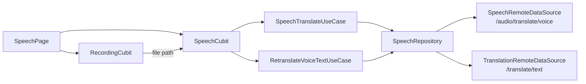

# 🎙️ Voice Translation API Integration — Summary

## Tổng quan

Tích hợp đầy đủ luồng **Ghi âm → Upload → STT → Dịch → Hiển thị → Sửa text gốc** cho UC05, tuân thủ Clean Architecture.

## Kiến trúc



## Luồng hoạt động

1. User bấm **mic** → `RecordingCubit.startRecording()` → ghi âm M4A
2. User bấm **stop** → `RecordingCubit.stopRecording()` → emit `RecordingSuccess(filePath)`
3. `BlocListener` nhận `RecordingSuccess` → gọi `SpeechCubit.translateAudio(filePath)`
4. `SpeechCubit` → `SpeechTranslateUseCase` → `SpeechRepository` → upload multipart to `/audio/translate/voice`
5. Backend: audio preprocessing → STT → translation → response
6. UI hiển thị kết quả với nút **Sửa** (✏️) trên text gốc
7. User sửa text → `SpeechCubit.retranslate()` → gọi `/translate/text` để dịch lại

## Files Created/Modified

### ✅ Domain Layer
| File | Purpose |
|---|---|
| [speech_entity.dart](file:///c:/Users/minhk/Downloads/TranslationAppFlutter/frontend/lib/features/speech/domain/entities/speech_entity.dart) | Entity cho kết quả voice translation |
| [speech_repository.dart](file:///c:/Users/minhk/Downloads/TranslationAppFlutter/frontend/lib/features/speech/domain/repositories/speech_repository.dart) | Abstract repository interface |
| [speech_to_text_usecase.dart](file:///c:/Users/minhk/Downloads/TranslationAppFlutter/frontend/lib/features/speech/domain/usecases/speech_to_text_usecase.dart) | UseCase upload audio + translate |
| [retranslate_voice_text_usecase.dart](file:///c:/Users/minhk/Downloads/TranslationAppFlutter/frontend/lib/features/speech/domain/usecases/retranslate_voice_text_usecase.dart) | UseCase dịch lại text đã sửa |

### ✅ Data Layer
| File | Purpose |
|---|---|
| [speech_remote_datasource.dart](file:///c:/Users/minhk/Downloads/TranslationAppFlutter/frontend/lib/features/speech/data/datasources/speech_remote_datasource.dart) | Multipart upload to `/audio/translate/voice` |
| [speech_repository_impl.dart](file:///c:/Users/minhk/Downloads/TranslationAppFlutter/frontend/lib/features/speech/data/repositories/speech_repository_impl.dart) | Repository impl (network check, auth, error handling) |

### ✏️ Presentation Layer (Refactored)
| File | Change |
|---|---|
| [speech_cubit.dart](file:///c:/Users/minhk/Downloads/TranslationAppFlutter/frontend/lib/features/speech/presentation/bloc/speech_cubit.dart) | Refactored: UseCases thay vì gọi DataSource trực tiếp. Thêm `retranslate()` |
| [speech_state.dart](file:///c:/Users/minhk/Downloads/TranslationAppFlutter/frontend/lib/features/speech/presentation/bloc/speech_state.dart) | Thêm `SpeechRetranslating` state |
| [speech_page.dart](file:///c:/Users/minhk/Downloads/TranslationAppFlutter/frontend/lib/features/speech/presentation/pages/speech_page.dart) | Tích hợp RecordingCubit + nút sửa text gốc + dialog chỉnh sửa |

### ✏️ DI
| File | Change |
|---|---|
| [injection_container.dart](file:///c:/Users/minhk/Downloads/TranslationAppFlutter/frontend/lib/injection_container.dart) | Full Speech DI: DataSource → Repository → UseCases → Cubit |

## Tính năng sửa text gốc

Khi STT nhận diện sai, user có thể:
1. Bấm nút ✏️ trên card text gốc
2. Dialog hiện ra với TextField chứa text hiện tại
3. User sửa → bấm "Dịch lại"
4. `SpeechCubit.retranslate()` gọi API `/translate/text` → cập nhật bản dịch

## Validation

```
> flutter analyze
No issues found!
```
